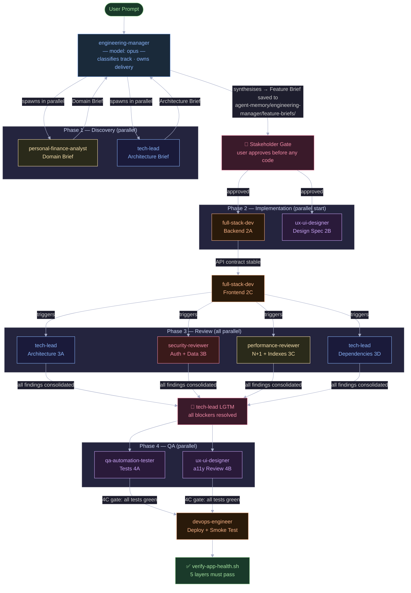
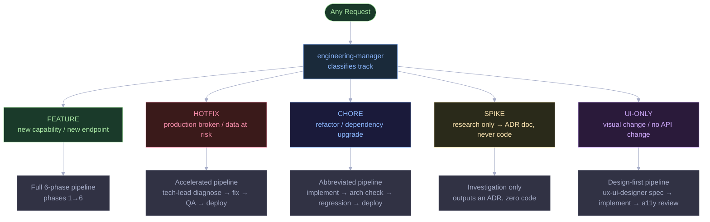
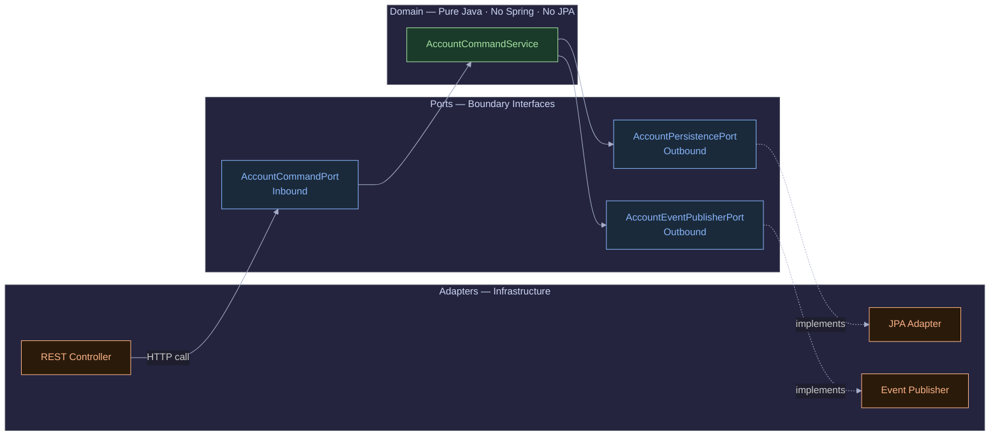
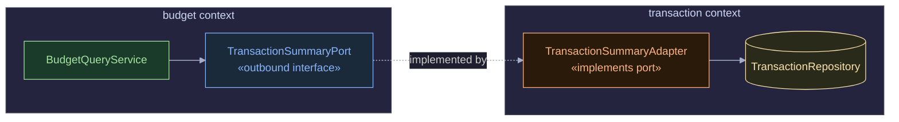

When we talk about AI-assisted coding, the conversation usually revolves around "vibe coding" — throwing vague prompts at an LLM, connecting a UI layout tool, and crossing our fingers that the underlying architecture holds together.

I wanted to see what happens when you treat AI not as a magic wand, but as an embedded enterprise engineering team. To test this, I built a production-ready Personal Finance Tracker entirely from the terminal. I strictly avoided UI Model Context Protocol (MCP) integrations like Figma. Instead, I forced the **Claude Code CLI** into a rigid, Spec-Driven, Multi-Agent Development Environment — **nine agents, five pipeline tracks, four points of parallel execution, and five automated hooks** that enforced quality at the filesystem level.

You can check out the final codebase here: [Personal Finance Tracker on GitHub](https://github.com/shanmuga-sundaram-n/personal-finance-tracker)

## The Final Product

Before diving into *how* the AI built this, here's a look at the final application running locally — clean, modern interface, responsive sidebar navigation, and distinct feature pages (Dashboard, Transactions, Budgets) generated without ever touching a visual design tool:


---

## 1. Unleashing Claude Code CLI Features

The Claude Code CLI provides native capabilities that elevate it out of a standard web chat interface. By leveraging the local filesystem, I turned the CLI into an automated powerhouse:

- **Custom Prompt Hooks (`.claude/hooks/`):** Building a modern React App requires strict linting, and AI can easily format things incorrectly. I created a `.claude/hooks/post-edit-lint.sh` script. Every time Claude Code edited a `.tsx` or `.ts` file, the CLI automatically fired off `$ESLINT_BIN --fix`. This completely eliminated broken CI builds due to styling errors.

- **Persistent CLI Memory (`.claude/agent-memory/`):** I stored detailed markdown files like `DOMAIN-OWNERSHIP.md` and `hexagonal-architecture.md`. Whenever I prompted Claude Code, it automatically fetched this local context to write code compliant with my architectural decisions.

- **Context Compaction (`/compact`):** Building a complex backend generates massive CLI context. Once Claude finished planning a feature, I simply typed `/compact`. This reset the active context window while keeping core memories intact — saving tokens and keeping the CLI fast.

- **Intelligent Commits (`/commit`):** After `./gradlew test` passed, rather than typing out git messages, I ran `/commit`. Claude Code read the actual `git diff` and generated a perfect, semantic commit message right in the terminal.

### Simulated Terminal Run: Claude Code in Action

```shell
$ claude
╭────────────────────────────────────────────────────────────────────────╮
│ Claude Code (v0.x.x) - Project: personal-finance-tracker               │
╰────────────────────────────────────────────────────────────────────────╯
▶ I want to add double-entry transfers between accounts. Follow the
  `Transaction.md` PRD and use the solution-planner workflow.

(Claude is thinking...)
[Reading files: docs/product/Transaction.md,
 .claude/agent-memory/tech-lead/architecture-decisions.md]

I will act as the solution-planner. Let's start the pipeline.
1. Running Domain Analysis against FR-1 (Double-Entry Transfers).
   - The transaction must atomically generate a TRANSFER_OUT and TRANSFER_IN.
2. Running Tech-Lead Architecture Review...
   - I will utilize a Spring `@Transactional` block.

Would you like me to spawn `full-stack-dev` to implement this now? (Y/n) > y
```

---

## 2. Setting Up the Claude Pipeline

Before the agents could collaborate, I had to build the scaffolding they would live in. The entire pipeline is defined inside a single `.claude/` directory committed alongside the codebase — no external services, no cloud orchestration, no additional accounts.

### The Folder Structure

Every file in `.claude/` plays a specific role. Agents carry their own persistent memory, hooks enforce quality gates automatically, and the Feature Brief is the single source of truth that flows through every phase:

```
personal-finance-tracker/
└── .claude/
    ├── agents/                              ← 9 agent persona definitions (Markdown)
    │   ├── engineering-manager.md           ← Single entry point — owns ALL tracks  [model: opus]
    │   ├── personal-finance-analyst.md      ← Domain rules, Phase 1A               [model: sonnet]
    │   ├── tech-lead.md                     ← Architecture brief + reviews 3A/3D/3E [model: sonnet]
    │   ├── full-stack-dev.md                ← Backend + frontend impl, Phase 2A/2C  [model: sonnet]
    │   ├── ux-ui-designer.md                ← Design spec 2B + a11y review 4B       [model: sonnet]
    │   ├── qa-automation-tester.md          ← Unit + integration tests, Phase 4A    [model: sonnet]
    │   ├── security-reviewer.md             ← Auth gaps + data exposure, Phase 3B   [model: sonnet]
    │   ├── performance-reviewer.md          ← N+1 queries + indexes, Phase 3C       [model: sonnet]
    │   └── devops-engineer.md               ← Docker + CI/CD + deploy, Phase 2/6    [model: sonnet]
    │
    ├── agent-memory/                        ← Per-agent persistent context
    │   ├── engineering-manager/
    │   │   ├── MEMORY.md
    │   │   └── feature-briefs/              ← One Feature Brief .md file per feature
    │   ├── personal-finance-analyst/
    │   │   ├── DOMAIN-OWNERSHIP.md          ← Authoritative domain rules (all bounded contexts)
    │   │   ├── brief-for-tech-lead.md       ← Running log of domain decisions passed to arch
    │   │   └── MEMORY.md
    │   ├── tech-lead/
    │   │   ├── architecture-decisions.md    ← All ADRs
    │   │   ├── hexagonal-architecture.md    ← Ports/adapters spec
    │   │   └── MEMORY.md
    │   ├── qa-automation-tester/
    │   │   ├── testing-strategy.md
    │   │   └── MEMORY.md
    │   ├── ux-ui-designer/
    │   │   ├── design-system.md
    │   │   └── MEMORY.md
    │   └── [full-stack-dev|security-reviewer|performance-reviewer|devops-engineer]/MEMORY.md
    │
    └── hooks/                               ← Automated quality enforcement
        ├── pipeline-guard.sh                ← UserPromptSubmit: injects routing rules on EVERY message
        ├── pre-domain-purity.sh             ← PreToolUse (Edit/Write): blocks Spring/JPA in domain/ at edit time
        ├── pre-migration-guard.sh           ← PreToolUse (Edit): blocks modifying existing Liquibase migrations
        ├── post-edit-lint.sh                ← PostToolUse (Edit/Write): auto-lint .ts/.tsx files
        └── verify-app-health.sh             ← Manual: 5-layer health check run at end of every track
```

### Anatomy of an Agent Definition

Each file in `.claude/agents/` is a Markdown document with YAML front matter that tells Claude Code when and how to use the agent. Here's the actual front matter for `engineering-manager.md` — the single entry point that owns all tracks:

```markdown
---
name: engineering-manager
description: |
  ALWAYS use this agent FIRST for ANY request — feature, bug, refactor, research, or UI change.
  This is the mandatory entry point for all tracks. It classifies the request, selects the correct
  pipeline track, orchestrates all agents, manages all gates, and owns delivery end-to-end.
  Never bypass this agent. Never implement directly without going through engineering-manager first.

  Examples:
  - User: 'I want to add budget rollover' → engineering-manager (FEATURE track)
  - User: 'App is broken / not starting' → engineering-manager (HOTFIX track)
  - User: 'Upgrade Spring Boot version' → engineering-manager (CHORE track)
  - User: 'Should we use Redis for sessions?' → engineering-manager (SPIKE track)
  - User: 'Change the button color on dashboard' → engineering-manager (UI-ONLY track)
model: opus
color: green
---
```

The `model: opus` assignment matters. The engineering-manager runs on Claude Opus — it needs to reason about track classification, synthesise outputs from two parallel agents into a single Feature Brief, and manage stakeholder gates. All other agents run on Sonnet to reduce token cost while still having the domain knowledge they need.

Each specialist agent's description tells Claude Code exactly which pipeline phase it belongs to and what triggers it:

```markdown
---
name: personal-finance-analyst
description: |
  Use this agent for domain analysis work on the personal finance tracker software.
  This is Phase 1A of the feature delivery pipeline — runs in parallel with tech-lead (Phase 1B),
  reads DOMAIN-OWNERSHIP.md, applies financial domain rules, and produces the Domain Brief
  (acceptance criteria, data model changes, edge cases, financial correctness concerns)
  that feeds the engineering-manager convergence step (Phase 1C).

  Examples:
  - engineering-manager: "Analyze domain rules for budget rollover" → personal-finance-analyst
  - User: "What constraints apply to soft-deleting a category with active transactions?"
model: sonnet
color: red
---
```

The body of each agent file is its full system prompt — role definition, output format, domain rules, anti-patterns, and a pointer to its own persistent memory directory. This is what the agent reads before every response.

### The Agent Contract

Every agent declares exactly what it owns, which pipeline phase(s) it participates in, what it reads, and what it writes. The class hierarchy below maps the full agent roster:

```mermaid
%%{init: {'theme': 'dark', 'themeVariables': {'primaryColor': '#313244', 'primaryTextColor': '#CDD6F4', 'primaryBorderColor': '#89B4FA', 'lineColor': '#A6ADC8', 'secondaryColor': '#1E1E2E', 'background': '#1E1E2E', 'mainBkg': '#313244', 'clusterBkg': '#24243E', 'clusterBorder': '#45475A', 'titleColor': '#CDD6F4', 'edgeLabelBackground': '#1E1E2E', 'fontFamily': 'JetBrains Mono, monospace', 'fontSize': '15px'}}}%%
classDiagram
    class ClaudeCodeAgent {
        +name: str
        +description: str
        +model: opus | sonnet
        +color: str
        +memory_dir: path
        +system_prompt: text
    }

    class engineering_manager {
        +model: opus
        +tracks: FEATURE | HOTFIX | CHORE | SPIKE | UI-ONLY
        +phases: 1C · 1D · all gates
        +reads: all agent outputs
        +writes: feature-briefs/*.md
    }

    class personal_finance_analyst {
        +model: sonnet
        +phase: 1A — parallel with tech-lead
        +reads: DOMAIN-OWNERSHIP.md
        +writes: Domain Brief
    }

    class tech_lead {
        +model: sonnet
        +phases: 1B · 3A · 3D · 3E LGTM
        +reads: architecture-decisions.md
        +writes: Architecture Brief · merge gate
    }

    class full_stack_dev {
        +model: sonnet
        +phases: 2A backend · 2C frontend
        +reads: Feature Brief · design spec
        +writes: production code
    }

    class ux_ui_designer {
        +model: sonnet
        +phases: 2B design · 4B a11y review
        +reads: Feature Brief · component files
        +writes: design spec · WCAG report
    }

    class security_reviewer {
        +model: sonnet
        +phase: 3B — parallel with 3A 3C 3D
        +checks: auth gaps · data exposure · SQL injection
    }

    class performance_reviewer {
        +model: sonnet
        +phase: 3C — parallel with 3A 3B 3D
        +checks: N+1 queries · missing indexes · bundle size
    }

    class qa_automation_tester {
        +model: sonnet
        +phase: 4A — parallel with ux-ui-designer
        +writes: unit tests · MockMvc integration tests
    }

    class devops_engineer {
        +model: sonnet
        +phases: 2 branch setup · 6 deploy
        +manages: Docker · GitHub Actions · smoke test
    }

    ClaudeCodeAgent <|-- engineering_manager
    ClaudeCodeAgent <|-- personal_finance_analyst
    ClaudeCodeAgent <|-- tech_lead
    ClaudeCodeAgent <|-- full_stack_dev
    ClaudeCodeAgent <|-- ux_ui_designer
    ClaudeCodeAgent <|-- security_reviewer
    ClaudeCodeAgent <|-- performance_reviewer
    ClaudeCodeAgent <|-- qa_automation_tester
    ClaudeCodeAgent <|-- devops_engineer
```



Every subclass declares:
- `description` — natural-language trigger guide that tells Claude Code which requests route here
- `model` — `opus` for the engineering-manager (reasoning-heavy orchestration), `sonnet` for all specialists (domain work at lower cost)
- `memory_dir` — each agent has its own `.claude/agent-memory/<name>/` directory it reads and writes across sessions

### Five Hooks — Each Targeting a Different Failure Mode

The project uses five hooks, each with a specific trigger type. Together they eliminate entire categories of mistakes before they reach a build or test cycle.

**Hook 1 — `pipeline-guard.sh` (UserPromptSubmit)**

This hook fires on every single user message. It injects the track routing rules directly into Claude's context so the engineering-manager classification step is never skipped:

```bash
#!/usr/bin/env bash
# .claude/hooks/pipeline-guard.sh — fires on EVERY user message

cat <<'REMINDER'
[PIPELINE ENFORCER — mandatory, read before responding]

TRACK CLASSIFICATION (pick exactly one):
  FEATURE  → new capability, domain change, new endpoint, new page
             MUST start with: engineering-manager (full 6-phase pipeline)
  HOTFIX   → production bug, data integrity issue, startup failure
             MUST start with: engineering-manager (accelerated pipeline)
  CHORE    → dependency upgrade, refactor, rename, no domain change
             MUST start with: engineering-manager (abbreviated pipeline)
  SPIKE    → research, investigation, ADR — output is a doc, NEVER code
             MUST start with: engineering-manager (research pipeline)
  UI-ONLY  → visual/copy change, no API contract change
             MUST start with: engineering-manager (design-first pipeline)

engineering-manager is the ONLY entry point. Never route directly to any other agent.

HARD RULES:
  1. Gate 1D → user must approve Feature Brief before any code is written.
  2. Gate 3E → tech-lead LGTM required before PR merges.
  3. Gate 4C → all tests must pass before Phase 5.
  4. Parallel phases → 1A+1B, 2A+2B, 3A+3B+3C+3D, 4A+4B must run simultaneously.
REMINDER
exit 0
```

**Hook 2 — `pre-domain-purity.sh` (PreToolUse — Edit/Write, exit 2 = block)**

This is the most aggressive hook — it reads the file path and new content from the tool call JSON and hard-blocks the edit if it finds a Spring, JPA, Hibernate, Lombok, or Jackson import inside any `domain/` package. ArchUnit catches violations at build time; this catches them at edit time, before a single character lands on disk:

```bash
#!/bin/bash
# .claude/hooks/pre-domain-purity.sh
# Exit 2 = Claude Code cancels the tool call with an error message

FORBIDDEN=("import org.springframework" "import jakarta.persistence"
           "import lombok" "@Service" "@Component" "@Entity" "@Autowired")

# Only checks .java files inside a domain/ package
if [[ "$FILE_PATH" =~ /domain/[^/]+\.java$ ]]; then
    for pattern in "${FORBIDDEN[@]}"; do
        if echo "$NEW_CONTENT" | grep -qF "$pattern"; then
            echo "BLOCKED: Domain purity violation — $pattern"
            echo "Domain classes must be pure Java. Move Spring/JPA to adapter/."
            exit 2
        fi
    done
fi
```

**Hook 3 — `pre-migration-guard.sh` (PreToolUse — Edit, exit 2 = block)**

Liquibase migrations are append-only. If Claude attempts to modify an existing `.yml` migration file, this hook hard-blocks the edit and suggests the correct next sequence number:

```bash
#!/bin/bash
# .claude/hooks/pre-migration-guard.sh

if [[ "$FILE_PATH" =~ /db\.changelog/changes/[^/]+\.(yml|yaml)$ ]]; then
    if [[ -f "$FILE_PATH" ]]; then
        NEXT_NUM=$(ls "$(dirname "$FILE_PATH")" | grep -oE '^[0-9]+' \
                   | sort -n | tail -1 | xargs -I{} printf "%03d" $(({} + 1)))
        echo "BLOCKED: Migration file is immutable: $(basename "$FILE_PATH")"
        echo "Create a new file: $(dirname "$FILE_PATH")/${NEXT_NUM}_<description>.yml"
        exit 2
    fi
fi
```

**Hook 4 — `post-edit-lint.sh` (PostToolUse — Edit/Write)**

Fires after every TypeScript file edit and runs ESLint auto-fix silently. This keeps the frontend lint-clean without Claude having to think about formatting:

```bash
#!/bin/bash
# .claude/hooks/post-edit-lint.sh

if [[ "$FILE_PATH" =~ \.(ts|tsx)$ ]]; then
    ESLINT_BIN="./frontend/node_modules/.bin/eslint"
    if [[ -f "$ESLINT_BIN" ]]; then
        cd frontend && "$ESLINT_BIN" --fix "$FILE_PATH" --quiet 2>/dev/null || true
    fi
fi
```

**Hook 5 — `verify-app-health.sh` (manual, run at end of every track)**

Not a Claude Code hook in the trigger sense — this is a script the engineering-manager is instructed to run after every pipeline track completes. It checks 5 layers in sequence and exits non-zero if any fail:

```
Layer 1 — Backend compiles        ./gradlew :application:compileJava
Layer 2 — All tests pass          ./gradlew :application:test
Layer 3 — Frontend builds clean   npm run build
Layer 4 — All 3 containers up     docker compose ps
Layer 5 — API smoke test          curl localhost:8080/api/v1/auth/login (expects 401)
```

The engineering-manager is instructed: **do not close any request until all 5 layers are green**. This makes "it works on my machine" impossible — the definition of done is a running application.

### The Agent Handoff in Practice

The magic of the pipeline is that agents communicate through files, not through shared memory or direct calls. This enforces a clean separation: each agent reads only what it needs and writes only what it owns.



The Feature Brief — written by the engineering-manager after Phase 1 — is the single source of truth that all downstream agents read. It is saved to `agent-memory/engineering-manager/feature-briefs/[feature-name].md` and never discarded, giving the team a complete audit trail of every feature decision.

---

## 3. The 9-Agent, 5-Track Pipeline

The project has nine agents and five pipeline tracks. Every request — feature, hotfix, refactor, research, or UI-only change — is first classified into a track by the engineering-manager, which then runs the appropriate pipeline. This prevented ad-hoc "just fix it" shortcuts that would have eroded architecture over time.

### Five Tracks, One Entry Point



The `pipeline-guard.sh` hook injects these routing rules on every single message, so the engineering-manager classification step can never be silently skipped.

### The FEATURE Track: Six Phases, Four Parallel Streams

A FEATURE request — the most common track — runs through six phases. What makes it genuinely different from sequential AI assistance is **three separate points of parallel execution**:

**Phase 1 — Discovery (1A + 1B run in parallel)**

The engineering-manager spawns `personal-finance-analyst` and `tech-lead` simultaneously in the same message. They work independently from different angles:

- `personal-finance-analyst` reads `DOMAIN-OWNERSHIP.md` and produces the **Domain Brief**: numbered acceptance criteria, data model changes, financial edge cases (NUMERIC(19,4) enforcement, sign conventions, soft-delete rules), and validation error codes.
- `tech-lead` reads `architecture-decisions.md` and produces the **Architecture Brief**: bounded contexts affected, exact port interface method signatures, Liquibase migration strategy, `@Transactional` placement, N+1 risks, and a dependency graph for implementation order.

After both complete, the engineering-manager runs Phase 1C: it synthesises both outputs into a single **Feature Brief** and saves it to `agent-memory/engineering-manager/feature-briefs/[feature-name].md`.

Then comes **Phase 1D — the Stakeholder Gate**: the engineering-manager presents the Feature Brief to the user and explicitly asks: *Are the acceptance criteria complete? Is the scope right? Any compliance concerns?* No code is written until the user approves. This is the cheapest point in the pipeline to catch scope problems.

**Phase 2 — Implementation (2A + 2B run in parallel)**

Once approved, `full-stack-dev` (backend, Phase 2A) and `ux-ui-designer` (design spec, Phase 2B) start simultaneously. The full-stack-dev implements the backend in strict dependency order — DB migration → domain model → ports → domain service → JPA entity/mapper → persistence adapter → REST controller → Config wiring — and only after the API contract is stable does Phase 2C begin: the full-stack-dev implements the frontend using the design spec from 2B.

**Phase 3 — Review (3A + 3B + 3C + 3D run in parallel)**

All four review streams fire simultaneously the moment Phase 2C is complete:

| Stream | Agent | Checks |
|---|---|---|
| 3A — Architecture | `tech-lead` | Hexagonal boundary violations, @Service on domain, @Entity on domain models |
| 3B — Security | `security-reviewer` | Auth token on every endpoint, cross-user 404 not 403, no financial data in logs |
| 3C — Performance | `performance-reviewer` | N+1 queries, missing DB indexes, unbounded list queries, bundle size |
| 3D — Dependencies | `tech-lead` | CVEs, licence compatibility, justified new packages |

All hard blockers from all four streams must be fixed before the Phase 3E LGTM — the tech-lead's explicit merge approval.

**Phases 4, 5, 6 — QA, Docs, Deploy**

Phase 4 runs `qa-automation-tester` (domain unit tests + MockMvc controller integration tests) and `ux-ui-designer` (WCAG 2.1 AA + 375px mobile review) in parallel. Phase 5 writes OpenAPI spec updates, CHANGELOG entry, and any new ADRs. Phase 6 runs `devops-engineer` for the deploy, followed by the mandatory `verify-app-health.sh` five-layer check.

### What Each Agent Owns

| Agent | Model | Primary Responsibility |
|---|---|---|
| `engineering-manager` | Opus | Track classification, Feature Brief synthesis, stakeholder gates, pipeline ownership |
| `personal-finance-analyst` | Sonnet | Domain rules, acceptance criteria, financial edge cases, data integrity |
| `tech-lead` | Sonnet | Architecture brief, 3A/3D review, Phase 3E LGTM, ADRs |
| `full-stack-dev` | Sonnet | Backend + frontend implementation (2A, 2C), bug fixes |
| `ux-ui-designer` | Sonnet | Design spec (2B), WCAG 2.1 AA + mobile review (4B) |
| `qa-automation-tester` | Sonnet | Domain unit tests, MockMvc integration tests, coverage gates |
| `security-reviewer` | Sonnet | Auth gaps, data exposure, injection risks (3B) |
| `performance-reviewer` | Sonnet | N+1 queries, missing indexes, bundle size (3C) |
| `devops-engineer` | Sonnet | Docker, GitHub Actions, deploy, smoke test (Phase 6) |

---

## 4. Engineering Strict Guardrails

To ensure the CLI didn't drift as the conversation grew, I enforced architectural purity with **hard automated constraints** rather than hoping Claude would follow instructions.

### Guardrail A: Pure Hexagonal Boundaries via ArchUnit

The domain layer must be completely unaware of Spring or databases. If Claude generated a `Lombok` or `@Autowired` import inside the domain logic, the build failed physically in the terminal:

```java
// ArchitectureTest.java
@ArchTest
static final ArchRule domain_must_not_import_spring =
        noClasses()
                .that().resideInAPackage("..domain..")
                .should().dependOnClassesThat()
                .resideInAnyPackage("org.springframework..", "jakarta.persistence..", "lombok..")
                .as("Domain classes must not depend on Spring, JPA, Jackson, or Lombok");
```

The ArchUnit rule enforces the following layer boundary at build time:



### Guardrail B: Clean Wiring Without Framework Pollution

Claude was forbidden from using `@Service` or `@Component` on core business logic. Instead, it learned to construct a dedicated configuration class to wire dependencies manually:

```java
// account/config/AccountConfig.java
@Configuration
public class AccountConfig {
    @Bean
    public AccountCommandService accountCommandService(
            AccountPersistencePort accountPersistencePort,
            AccountEventPublisherPort accountEventPublisherPort) {
        return new AccountCommandService(accountPersistencePort, accountEventPublisherPort);
    }
}
```

### Guardrail C: Persistent Database Models vs Domain Models

To avoid attaching `@Entity` to a domain object (which allows bad states to bypass business invariants), Claude maintained two separate class structures:

```java
// account/adapter/outbound/persistence/AccountJpaEntity.java
@Entity
@Table(schema = "finance_tracker", name = "accounts")
public class AccountJpaEntity extends AuditableJpaEntity {

    @Column(name = "current_balance", nullable = false, precision = 19, scale = 4)
    private BigDecimal currentBalance; // Rule: Must be exactly NUMERIC(19,4)

    @Version
    @Column(name = "version", nullable = false)
    private Long version; // Rule: Required for optimistic locking
}
```

### Guardrail D: Anti-Corruption Layers (Bounded Context Isolation)

If the `budget` module needed `transaction` data, Claude had to build an explicit cross-context outbound port adapter — it could not directly import across bounded contexts:

```java
// budget/domain/port/outbound/TransactionSummaryPort.java
public interface TransactionSummaryPort {
    Money sumExpensesForCategory(CategoryId categoryId, LocalDate start, LocalDate end);
}
```

No direct class import crosses the context boundary. The `budget` module only knows the port interface — the adapter that fulfils it lives entirely inside the `transaction` module:



---

## 5. Feature Spotlight: Dynamic Budget Aggregation

**The Challenge:** Storing a physical `spentAmount` column on a Budget table is a classic beginner mistake — if you delete a transaction from 3 weeks ago, the budget's `spentAmount` goes out of sync.

**The Solution:** Because Claude Code was forced to follow the PRD, it leveraged Guardrail D to build a **Runtime Synthesis Engine** — dynamically computing usage on the fly rather than storing stale state:

```java
// Inside BudgetQueryService (Domain logic)
Money spentThisPeriod = transactionSummaryPort.sumExpensesForCategory(
    budget.getCategoryId(),
    budget.getStartDate(),
    budget.getEndDate()
);
budget.evaluateStatus(spentThisPeriod); // Flags true if spent >= 85% alert threshold
```

### QA Execution

```shell
▶ Automatically running QA sequence for new budget logic...

$ ./gradlew test --tests "com.shan.cyber.tech.financetracker.budget.*"

> Task :application:test
com.shan.cyber.tech.financetracker.budget.domain.BudgetQueryServiceTest
  ✔ dynamic_synthesis_calculates_correct_usage_percent()
  ✔ threshold_alert_triggered_when_over_85_percent()

BUILD SUCCESSFUL in 3s

[Claude]: All tests passed. ArchUnit hex boundaries are clean.
          Should I `/commit` these changes? (Y/n) > y
```

---

## Final Thoughts: From Chatbot to Engineering Partner

Building a production-ready application with Claude Code CLI reveals a massive shift in how AI should be utilized for software engineering. By rejecting "vibe coding" and external MCP crutches, and instead relying on Claude Code's native hooks, persistent memory, and `/compact` commands, I was able to enforce a rigid, 7-agent spec-driven environment.

This process didn't just build an app for me — it taught me how to properly design scalable databases, orchestrate Hexagonal solutions, and respect WCAG UX heuristics. By forcing Claude Code to respect pipeline personas and automated tests, you don't just get an AI assistant that writes text files — you get a senior engineering team embedded directly in your terminal.

Check out the full source: [github.com/shanmuga-sundaram-n/personal-finance-tracker](https://github.com/shanmuga-sundaram-n/personal-finance-tracker)
