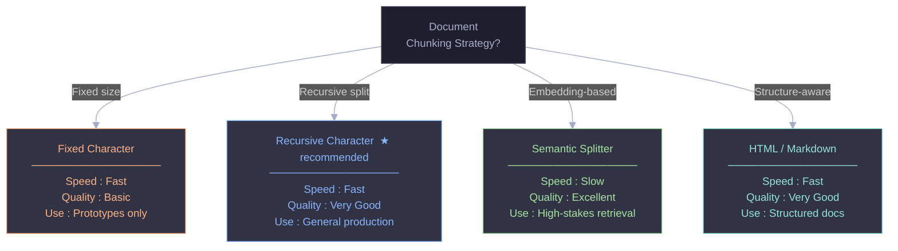
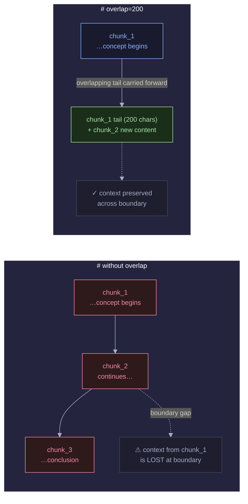
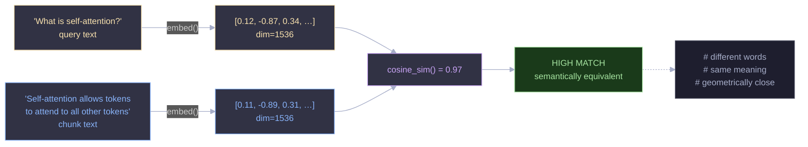
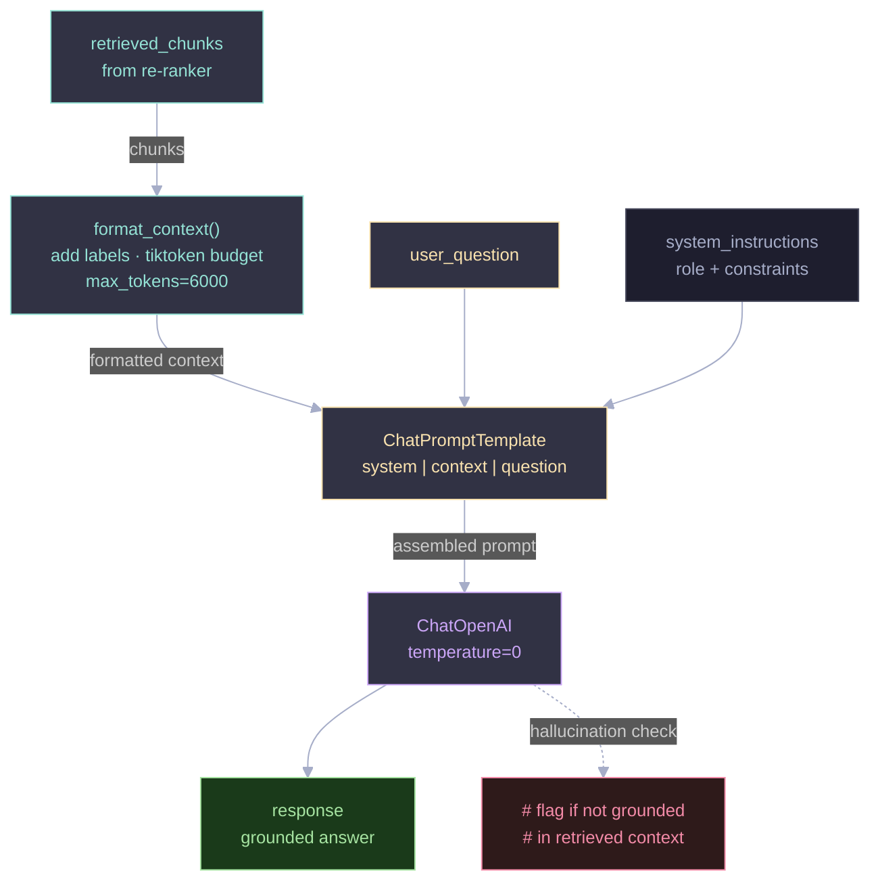
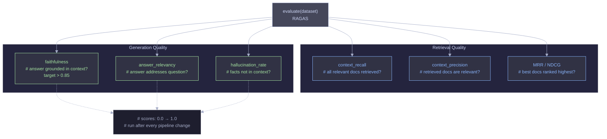

I've read probably a dozen RAG tutorials. They all do the same thing: show you how to embed a handful of PDFs into a vector store, run a similarity search, stuff the results into a prompt, and call it a production pipeline. Then you try to use the same approach on real data — thousands of documents, mixed formats, users with messy natural language queries — and the whole thing falls apart. The answers are vague, wrong, or confidently referencing documents that have nothing to do with the question.

That gap between "works in the tutorial" and "works in production" is what this post is about. I've built a few of these pipelines now, and I've made almost every mistake there is to make — wrong chunk sizes, no overlap, skipping the re-ranker, shipping without any evaluation. I'm going to walk through the full pipeline — from chunking to evaluation — not as a sanitized tutorial, but as the thing I wish I'd had when I started building this stuff for real.

We'll use LangChain, ChromaDB, and OpenAI throughout. If you use different tools, the concepts all transfer.

---

## The Two Phases You Need to Separate in Your Head

Before any code, the most important mental model is that RAG is two completely separate systems that happen to share a vector database.

The **indexing pipeline** is offline. It runs on a schedule or when documents change. It loads your source files, chunks them, converts them to embeddings, and writes them to a vector store. Speed isn't critical here. Correctness is.

The **query pipeline** is online. It runs on every user request, and it needs to be fast. It embeds the user's question, retrieves the most relevant chunks, builds a prompt, and calls the LLM.

```mermaid
%%{init: {'theme': 'dark', 'themeVariables': {'primaryColor': '#313244', 'primaryTextColor': '#CDD6F4', 'primaryBorderColor': '#89B4FA', 'lineColor': '#A6ADC8', 'secondaryColor': '#24243E', 'background': '#1E1E2E', 'mainBkg': '#313244', 'clusterBkg': '#24243E', 'clusterBorder': '#45475A', 'titleColor': '#CDD6F4', 'edgeLabelBackground': '#1E1E2E', 'fontFamily': 'JetBrains Mono, monospace', 'fontSize': '13px'}}}%%
flowchart LR
    classDef yellow  fill:#313244,stroke:#F9E2AF,color:#F9E2AF,rx:4
    classDef blue    fill:#313244,stroke:#89B4FA,color:#89B4FA,rx:4
    classDef mauve   fill:#313244,stroke:#CBA6F7,color:#CBA6F7,rx:4
    classDef green   fill:#1A3A1A,stroke:#A6E3A1,color:#A6E3A1,rx:4
    classDef red     fill:#313244,stroke:#F38BA8,color:#F38BA8,rx:4

    subgraph OFFLINE["① OFFLINE · INDEXING"]
        A["Documents<br/>PDF / HTML / TXT"]:::yellow
        B["Document Loader"]:::blue
        C["Text Splitter<br/>chunk_size=1000, overlap=200"]:::blue
        D["Embedding Model<br/>text-embedding-3-large"]:::mauve
        A --> B --> C --> D
    end

    VS[("Vector Store<br/>ChromaDB")]:::green

    D --> VS

    subgraph ONLINE["② ONLINE · QUERY"]
        F["User Question"]:::yellow
        G["Embed Question"]:::blue
        H["Similarity Search<br/>MMR  k=5, fetch_k=20"]:::blue
        I["Re-ranker<br/>cross-encoder  top-5"]:::red
        J["Prompt Builder → LLM<br/>temperature=0"]:::green
        K(["Answer"]):::green
        F --> G --> H --> I --> J --> K
    end

    VS -->|top-k chunks| H
```



Keeping these two phases decoupled is the first thing most tutorials get wrong. If your indexing and querying code are tangled together, you'll end up in situations where you can't re-index without restarting your query service, or where a slow re-embed job blocks user requests. Treat them as separate processes from day one.

Here's how to get your environment set up:

```python
# requirements.txt equivalent — install these first
# pip install langchain langchain-openai langchain-chroma chromadb openai tiktoken pypdf

import os
from pathlib import Path

# Set your API key
os.environ["OPENAI_API_KEY"] = "your-openai-api-key"

# Verify environment
import openai
import chromadb
import langchain

print(f"LangChain version: {langchain.__version__}")
print(f"ChromaDB version: {chromadb.__version__}")
print("Environment ready")
```

Run this and confirm your package versions before going further. Version mismatches between LangChain and ChromaDB have caused me more pain than any bug I've written myself.

---

## Chunking: The Part I Got Wrong for Two Weeks

I'll be direct: chunk size is the single most important decision in this entire pipeline. It took me two weeks of debugging poor retrieval quality before I realized my chunks were the problem, not my embedding model or retrieval code. I had set `chunk_size=2000` thinking "more context = better" and ended up with bloated, unfocused chunks that pulled in too much noise along with the relevant content.

The intuition is simple. A chunk is the atomic unit of retrieval. When a user asks a question, the system fetches the N most relevant chunks and hands them to the LLM. If your chunks are too large, each one contains multiple topics and the similarity score gets diluted. Too small, and you end up with fragments that don't make sense without their surrounding context.



For most use cases, `RecursiveCharacterTextSplitter` with `chunk_size=1000` and `chunk_overlap=200` is a solid starting point. The recursive part matters: it tries to split on paragraph breaks first, then sentence boundaries, then spaces, only falling back to raw character splits as a last resort. This means your chunks are much more likely to contain complete thoughts rather than sentences cut in half.

The overlap is non-negotiable. Without it, a concept that straddles a chunk boundary gets split in two, and whichever half gets retrieved will be missing critical context.



```python
from langchain_community.document_loaders import PyPDFLoader, DirectoryLoader
from langchain.text_splitter import RecursiveCharacterTextSplitter
from langchain.schema import Document
from typing import List

def load_documents(source_dir: str) -> List[Document]:
    """Load all PDF documents from a directory."""
    loader = DirectoryLoader(
        source_dir,
        glob="**/*.pdf",
        loader_cls=PyPDFLoader,
        show_progress=True
    )
    documents = loader.load()
    print(f"Loaded {len(documents)} pages from {source_dir}")
    return documents


def chunk_documents(
    documents: List[Document],
    chunk_size: int = 1000,
    chunk_overlap: int = 200
) -> List[Document]:
    """
    Split documents into overlapping chunks.

    chunk_overlap=200 ensures continuity — if a concept spans a chunk
    boundary, both chunks will contain enough context to be meaningful.
    """
    splitter = RecursiveCharacterTextSplitter(
        chunk_size=chunk_size,
        chunk_overlap=chunk_overlap,
        # Try these separators in order — fall back to the next if needed
        separators=["\n\n", "\n", ". ", " ", ""],
        length_function=len,
    )

    chunks = splitter.split_documents(documents)

    print(f"Split {len(documents)} pages into {len(chunks)} chunks")
    print(f"Average chunk size: {sum(len(c.page_content) for c in chunks) // len(chunks)} chars")

    return chunks


# --- Run it ---
docs = load_documents("./docs")
chunks = chunk_documents(docs, chunk_size=1000, chunk_overlap=200)

# Inspect a sample chunk
sample = chunks[5]
print(f"\n--- Sample Chunk ---")
print(f"Content: {sample.page_content[:300]}...")
print(f"Metadata: {sample.metadata}")
```

You should see chunk counts and average sizes printed out. I strongly recommend inspecting a handful of sample chunks manually before proceeding. If your chunks look like they're cutting off mid-sentence constantly, drop the `chunk_size` or double-check that your separator list is actually matching your document structure.

One more thing I wish someone had told me: always print the average chunk size after splitting. If it's dramatically smaller than your target (say, you set 1000 but average is 400), your documents are full of very short paragraphs and you probably need to reconsider your separator strategy.

---

## Embeddings and the Vector Store: Boring but Critical

This part feels like plumbing, and it kind of is. But bad plumbing causes leaks.

The premise is that semantically similar text produces vectors that are geometrically close in high-dimensional space. "How does attention work?" and "Explain the self-attention mechanism" don't share many words, but their embeddings will be very close because they mean the same thing. That's the whole trick.



I use `text-embedding-3-large` for anything where quality matters. It's more expensive than `text-embedding-3-small`, but for a knowledge base application the quality difference is real and the cost per query is still small. For high-volume applications where you're embedding millions of documents and running thousands of queries a day, `text-embedding-3-small` is worth benchmarking.

```python
from langchain_openai import OpenAIEmbeddings
from langchain_chroma import Chroma
import chromadb

def build_vector_store(
    chunks: List[Document],
    persist_directory: str = "./chroma_db",
    collection_name: str = "knowledge_base"
) -> Chroma:
    """
    Embed all document chunks and store them in ChromaDB.

    Uses text-embedding-3-large for best retrieval quality.
    Falls back gracefully if the store already exists.
    """

    # Initialize the embedding model
    # text-embedding-3-large: 1536 dims, excellent quality
    # text-embedding-3-small: cheaper, good for high-volume apps
    embeddings = OpenAIEmbeddings(
        model="text-embedding-3-large",
        dimensions=1536
    )

    # Check if vector store already exists to avoid re-embedding
    if Path(persist_directory).exists():
        print(f"Loading existing vector store from {persist_directory}")
        vector_store = Chroma(
            collection_name=collection_name,
            embedding_function=embeddings,
            persist_directory=persist_directory
        )
    else:
        print(f"Building new vector store with {len(chunks)} chunks...")

        # Chroma.from_documents handles embedding + storing in one call
        vector_store = Chroma.from_documents(
            documents=chunks,
            embedding=embeddings,
            collection_name=collection_name,
            persist_directory=persist_directory,
        )
        print(f"Vector store built and persisted to {persist_directory}")

    # Verify the store
    count = vector_store._collection.count()
    print(f"Vector store contains {count} vectors")

    return vector_store


# --- Build it ---
vector_store = build_vector_store(chunks)
```

In production, documents change. People update wikis, replace PDFs, add new reports. You don't want to re-embed your entire corpus every time a single file changes. The incremental indexing pattern below handles this with a simple content hash:

```python
import hashlib
from datetime import datetime

def get_document_hash(doc: Document) -> str:
    """Generate a stable hash for a document chunk based on its content."""
    return hashlib.md5(doc.page_content.encode()).hexdigest()

def upsert_documents(
    vector_store: Chroma,
    new_chunks: List[Document]
) -> dict:
    """
    Add only new/changed documents to an existing vector store.
    Avoids re-embedding documents that haven't changed.
    """
    # Fetch all existing document IDs from the store
    existing = vector_store._collection.get(include=["metadatas"])
    existing_hashes = {
        meta.get("content_hash")
        for meta in existing["metadatas"]
        if meta.get("content_hash")
    }

    # Filter to only chunks we haven't seen before
    new_docs = []
    for chunk in new_chunks:
        content_hash = get_document_hash(chunk)
        if content_hash not in existing_hashes:
            # Stamp the chunk with its hash for future deduplication
            chunk.metadata["content_hash"] = content_hash
            chunk.metadata["indexed_at"] = datetime.now().isoformat()
            new_docs.append(chunk)

    if new_docs:
        vector_store.add_documents(new_docs)
        print(f"Added {len(new_docs)} new chunks to the vector store")
    else:
        print("No new documents to index — everything is up to date")

    return {"added": len(new_docs), "skipped": len(new_chunks) - len(new_docs)}
```

The first time you run this on a large corpus, embedding takes a while. Budget accordingly. On 10,000 chunks with `text-embedding-3-large`, expect roughly 2-3 minutes and a few dollars in API costs.

---

## Retrieval: Where Most Pipelines Silently Die

Here's what I mean by "silently." A naive similarity search will almost always return *something*. The chunks it returns will usually be topically related to the query. The LLM will usually produce a fluent, confident answer. The problem is that the answer might be incomplete, subtly wrong, or built on the third-best chunk rather than the most relevant one. You'll never know unless you're logging and measuring.

The two main failure modes I've seen:

**Redundant retrieval.** You ask for `k=5` chunks and get back 5 chunks that all say essentially the same thing. You've used your entire context window on one perspective of the topic and left out everything else.

**Unfocused retrieval in multi-domain knowledge bases.** If your vector store has documents from HR, engineering, finance, and legal all mixed together, a query about "approval process" might retrieve chunks from three different departments when the user only cared about one.


MMR (Maximal Marginal Relevance) solves the redundancy problem. Instead of returning the top-K most similar chunks, it returns the top-K that are both relevant to the query *and* maximally different from each other. I should have been using this from the start.

```python
def build_retriever(vector_store: Chroma, strategy: str = "mmr"):
    """
    Build a retriever with different strategies:
    - 'similarity': pure cosine similarity (fast, simple)
    - 'mmr': Maximal Marginal Relevance (diverse results, reduces redundancy)
    - 'filtered': similarity with metadata filtering
    """

    if strategy == "similarity":
        # Basic similarity search — good for small, focused knowledge bases
        retriever = vector_store.as_retriever(
            search_type="similarity",
            search_kwargs={"k": 5}
        )

    elif strategy == "mmr":
        # MMR balances relevance AND diversity
        # fetch_k=20: fetch 20 candidates, then select 5 maximally diverse ones
        retriever = vector_store.as_retriever(
            search_type="mmr",
            search_kwargs={
                "k": 5,           # final number of results
                "fetch_k": 20,    # candidate pool size
                "lambda_mult": 0.7  # 1.0 = pure similarity, 0.0 = pure diversity
            }
        )

    elif strategy == "filtered":
        # Filter by metadata before similarity search
        # Useful when documents have tags, dates, categories, etc.
        retriever = vector_store.as_retriever(
            search_type="similarity",
            search_kwargs={
                "k": 5,
                "filter": {"source": "annual_report_2025.pdf"}
            }
        )

    return retriever


def retrieve_with_scores(vector_store: Chroma, query: str, k: int = 5):
    """
    Retrieve chunks with their similarity scores for debugging/logging.
    """
    results = vector_store.similarity_search_with_score(query, k=k)

    print(f"\nQuery: '{query}'")
    print(f"{'─' * 60}")
    for i, (doc, score) in enumerate(results):
        # ChromaDB returns L2 distance (lower = more similar)
        # Convert to 0-1 similarity for readability
        similarity = 1 / (1 + score)
        print(f"\nResult {i+1} | Similarity: {similarity:.3f}")
        print(f"Source: {doc.metadata.get('source', 'unknown')}")
        print(f"Content: {doc.page_content[:200]}...")

    return results


# --- Test retrieval ---
retriever = build_retriever(vector_store, strategy="mmr")
results = retrieve_with_scores(
    vector_store,
    query="How does self-attention work in transformers?",
    k=5
)
```

Run this and look at the similarity scores. If your top result is below 0.75, something is off. Either your chunks are too large, your embedding model is mismatched for your domain, or your documents genuinely don't contain a good answer to the query.

### The re-ranker I resisted for too long

Honestly, I avoided adding a cross-encoder re-ranker for months because of the added latency. That was a mistake. The difference in retrieval quality was significant enough that I ended up adding it anyway after watching users get mediocre answers on questions that should have been easy.

The core issue is that embedding models (bi-encoders) work by embedding the query and each document *independently* and then comparing them. They're fast but coarse. A cross-encoder, by contrast, takes the query and a document together as a pair and scores them jointly. It's much more accurate at judging whether a specific document actually answers a specific question.

The trade-off: cross-encoders are slow. You wouldn't use one to search a million documents. But used as a re-ranker on the top 20 candidates your vector store already retrieved, the latency is acceptable (usually 50-150ms for a batch of 20).

```python
from sentence_transformers import CrossEncoder

class CrossEncoderReranker:
    """Re-rank retrieved documents using a cross-encoder model."""

    def __init__(self, model_name: str = "cross-encoder/ms-marco-MiniLM-L-6-v2"):
        self.model = CrossEncoder(model_name)

    def rerank(
        self,
        query: str,
        documents: List[Document],
        top_n: int = 5
    ) -> List[Document]:
        """
        Score each (query, document) pair and return top_n by score.
        """
        # Build pairs for the cross-encoder
        pairs = [(query, doc.page_content) for doc in documents]

        # Cross-encoder scores each pair (query is considered with each doc)
        scores = self.model.predict(pairs)

        # Sort by score descending, keep top_n
        ranked = sorted(
            zip(scores, documents),
            key=lambda x: x[0],
            reverse=True
        )

        top_docs = [doc for _, doc in ranked[:top_n]]

        print(f"Re-ranked {len(documents)} → {top_n} documents")
        for i, (score, doc) in enumerate(ranked[:top_n]):
            print(f"  Rank {i+1}: score={score:.3f} | {doc.page_content[:80]}...")

        return top_docs


# --- Use the re-ranker ---
reranker = CrossEncoderReranker()
candidate_docs = retriever.invoke("How does self-attention work?")
reranked_docs = reranker.rerank(
    query="How does self-attention work?",
    documents=candidate_docs,
    top_n=3
)
```

With the re-ranker in place, your retrieval pipeline now works in two stages: the vector store does a fast, broad sweep to surface 20 candidates, and the cross-encoder does a precise, slow pass to select the best 3-5 from that pool. That's the combination I'd use as a default for any knowledge base application.

---

## Prompt Construction: Don't Waste Good Retrieval on a Bad Prompt

You've worked hard to get the right chunks. Now you need to actually use them well. This part is simpler than the retrieval work but still matters more than most people give it credit for.



Two things consistently trip people up here.

First, token budgets. If you're not explicitly counting tokens before building your prompt, you are relying on luck. LangChain won't error out when you exceed the context window. It'll silently truncate, and you'll get answers based on incomplete context. Always count with tiktoken.

Second, the system prompt. Tell the model to cite its sources, tell it to say "I don't know" when the context doesn't contain the answer, and tell it explicitly not to draw on outside knowledge. Without these constraints, GPT-4 in particular will happily synthesize an answer from its training data when the retrieved context falls short, and you'll have no idea it's doing it.

```python
from langchain_openai import ChatOpenAI
from langchain.prompts import ChatPromptTemplate
from langchain.schema.output_parser import StrOutputParser
import tiktoken

# ── Token budget management ──────────────────────────────────────────
def count_tokens(text: str, model: str = "gpt-4o") -> int:
    """Count tokens using tiktoken to avoid exceeding context window."""
    enc = tiktoken.encoding_for_model(model)
    return len(enc.encode(text))

def format_context(docs: List[Document], max_tokens: int = 6000) -> str:
    """
    Format retrieved docs into a context string, respecting a token budget.
    Prioritizes earlier (higher-ranked) chunks when truncating.
    """
    context_parts = []
    total_tokens = 0

    for i, doc in enumerate(docs):
        chunk_text = f"[Source {i+1}: {doc.metadata.get('source', 'unknown')}]\n{doc.page_content}"
        chunk_tokens = count_tokens(chunk_text)

        if total_tokens + chunk_tokens > max_tokens:
            print(f"Token budget reached at chunk {i+1}. Truncating context.")
            break

        context_parts.append(chunk_text)
        total_tokens += chunk_tokens

    print(f"Context: {len(context_parts)} chunks, {total_tokens} tokens")
    return "\n\n---\n\n".join(context_parts)


# ── Prompt Template ───────────────────────────────────────────────────
RAG_PROMPT = ChatPromptTemplate.from_messages([
    ("system", """You are a precise, helpful assistant. Answer the user's question
using ONLY the information provided in the context below.

Rules:
- If the context doesn't contain enough information to answer confidently, say so explicitly.
- Do not make up facts not present in the context.
- Cite the source number (e.g. [Source 1]) when referencing specific information.
- Be concise but complete.

Context:
{context}
"""),
    ("human", "{question}")
])


# ── Full RAG Pipeline ─────────────────────────────────────────────────
class RAGPipeline:
    def __init__(
        self,
        vector_store: Chroma,
        model_name: str = "gpt-4o",
        retrieval_strategy: str = "mmr",
        use_reranker: bool = True
    ):
        self.retriever = build_retriever(vector_store, strategy=retrieval_strategy)
        self.reranker = CrossEncoderReranker() if use_reranker else None
        self.llm = ChatOpenAI(model=model_name, temperature=0)
        self.prompt = RAG_PROMPT

    def run(self, question: str) -> dict:
        """Execute the full RAG pipeline and return answer + sources."""

        # Step 1: Retrieve candidate chunks
        print(f"\n[1/4] Retrieving candidates for: '{question}'")
        candidates = self.retriever.invoke(question)
        print(f"      Retrieved {len(candidates)} candidates")

        # Step 2: Re-rank (optional)
        if self.reranker:
            print(f"[2/4] Re-ranking candidates...")
            docs = self.reranker.rerank(question, candidates, top_n=4)
        else:
            docs = candidates[:4]

        # Step 3: Format context with token budget
        print(f"[3/4] Formatting context...")
        context = format_context(docs, max_tokens=6000)

        # Step 4: Generate response
        print(f"[4/4] Generating response...")
        chain = self.prompt | self.llm | StrOutputParser()
        answer = chain.invoke({"context": context, "question": question})

        # Collect source metadata
        sources = list({doc.metadata.get("source", "unknown") for doc in docs})

        return {
            "question": question,
            "answer": answer,
            "sources": sources,
            "chunks_used": len(docs)
        }


# ── Run it end-to-end ─────────────────────────────────────────────────
pipeline = RAGPipeline(
    vector_store=vector_store,
    model_name="gpt-4o",
    retrieval_strategy="mmr",
    use_reranker=True
)

result = pipeline.run("What is the difference between self-attention and cross-attention?")

print("\n" + "═" * 60)
print(f"Question: {result['question']}")
print(f"Answer:\n{result['answer']}")
print(f"\nSources: {result['sources']}")
print(f"Chunks used: {result['chunks_used']}")
```

When you run this, you'll see the pipeline logging each stage (retrieval, re-ranking, context formatting, generation) along with the final answer and the source documents it drew from. That logging isn't cosmetic; it's how you debug when something goes wrong.

Also: `temperature=0`. I cannot stress this enough. RAG applications are not creative writing tasks. You want the model to be deterministic and faithful to its context. Set it to zero and leave it there.

---

## You Can't Improve What You Don't Measure

Here's a question most RAG tutorials skip entirely: how do you know your pipeline is actually good?

"It seems to answer things correctly" is not an answer. I've seen pipelines that produce fluent, confident, well-structured responses that are subtly wrong 30% of the time. You won't catch that without systematic evaluation.



RAGAS is the library I use for this. It evaluates four things that matter:

**Faithfulness** measures whether the answer is actually grounded in the retrieved context. This is your hallucination detector. A low score here means your LLM is drawing on its parametric memory instead of your documents.

**Answer relevancy** measures whether the answer actually addresses the question. You can be faithful to the context while still giving a technically correct but non-responsive answer.

**Context recall** and **context precision** measure the retrieval layer specifically: did you get the right documents, and only the right documents?

```python
# pip install ragas datasets
from ragas import evaluate
from ragas.metrics import (
    faithfulness,        # Is the answer grounded in the retrieved context?
    answer_relevancy,   # Does the answer actually address the question?
    context_recall,     # Were the relevant documents retrieved?
    context_precision,  # Are the retrieved documents actually relevant?
)
from datasets import Dataset

def evaluate_rag_pipeline(pipeline: RAGPipeline, test_cases: list) -> dict:
    """
    Evaluate the RAG pipeline on a set of test cases using RAGAS metrics.

    test_cases format:
    [
        {
            "question": "...",
            "ground_truth": "...",  # Expected answer
        },
        ...
    ]
    """

    questions = []
    answers = []
    contexts = []
    ground_truths = []

    print(f"Running evaluation on {len(test_cases)} test cases...")

    for i, test in enumerate(test_cases):
        print(f"  Test {i+1}/{len(test_cases)}: {test['question'][:60]}...")

        result = pipeline.run(test["question"])

        # Also retrieve raw context for RAGAS
        raw_docs = pipeline.retriever.invoke(test["question"])
        context_texts = [doc.page_content for doc in raw_docs[:4]]

        questions.append(test["question"])
        answers.append(result["answer"])
        contexts.append(context_texts)
        ground_truths.append(test["ground_truth"])

    # Build dataset for RAGAS
    eval_dataset = Dataset.from_dict({
        "question": questions,
        "answer": answers,
        "contexts": contexts,
        "ground_truth": ground_truths
    })

    # Run RAGAS evaluation
    scores = evaluate(
        eval_dataset,
        metrics=[faithfulness, answer_relevancy, context_recall, context_precision]
    )

    return scores


# --- Define test cases ---
test_cases = [
    {
        "question": "What is the role of positional encoding in transformers?",
        "ground_truth": "Positional encoding adds information about the position of tokens in a sequence, since the transformer architecture itself has no inherent notion of order."
    },
    {
        "question": "How does multi-head attention differ from single-head attention?",
        "ground_truth": "Multi-head attention runs self-attention multiple times in parallel with different learned projections, allowing the model to attend to information from different representation subspaces."
    }
]

scores = evaluate_rag_pipeline(pipeline, test_cases)
print("\nEvaluation Results:")
print(f"  Faithfulness:       {scores['faithfulness']:.3f}")
print(f"  Answer Relevancy:   {scores['answer_relevancy']:.3f}")
print(f"  Context Recall:     {scores['context_recall']:.3f}")
print(f"  Context Precision:  {scores['context_precision']:.3f}")
```

You'll get four scores between 0 and 1. Faithfulness below 0.85 tells you your LLM is going off-script. Context precision below 0.80 tells you your retrieval is pulling in irrelevant chunks. Start with a test set of 20-30 questions and treat these numbers as your baseline before you change anything else.

---

## What I'd Tell Myself Before Starting

A few things I've distilled from all of this:

**Chunk size is where you should spend your debugging time first.** Before you blame your embedding model or experiment with exotic retrieval strategies, print out some sample chunks and ask yourself whether they contain coherent, complete thoughts. This is unglamorous work but it pays off faster than anything else.

**The indexing and query pipelines are separate systems.** Build them that way from the start. Your future self will thank you when you need to re-index 50,000 documents at 2am without touching the query service.

**Use MMR.** Pure cosine similarity is fine for demos. In production with a real knowledge base, you'll get redundant results constantly. MMR takes an extra parameter and fixes this. There's no good reason not to use it.

On re-ranking: I resisted it for too long. The latency cost (50-150ms) is real, but for a knowledge base application where users expect accurate answers, it's worth it. If you're building something latency-sensitive, benchmark both and decide with data rather than intuition.

The most underrated practice here is writing test cases before you optimize anything. It's easy to spend a day tuning chunk sizes or trying different embedding models and convince yourself things are getting better based on a handful of manual tests. RAGAS scores on a fixed test set give you a real signal. Without them, you're just guessing.

I'm still not 100% sure semantic chunking is worth the overhead for most applications. It produces better-quality chunks in theory, and in isolated tests I've seen it improve context precision by a few points. But it's significantly slower at indexing time and adds a dependency on another embedding pass. For now, I default to recursive character splitting and only reach for semantic chunking when I have evidence that chunk quality is the bottleneck.

---

## Where This Goes Next

The honest answer is that RAG is still an unsolved problem. The pipeline in this post works well, but I've been watching a few developments closely.

Query rewriting is probably the next thing I add to this stack — having the LLM rephrase the user's raw question before retrieval catches a lot of cases where users ask things in a way that's natural for a human but terrible for semantic search. Hybrid search (combining BM25 keyword matching with vector similarity) is also on my list, especially for domains where exact terminology matters.

What I keep coming back to, though, is something less exciting: better document preparation. The more time I've spent on these systems, the more I believe that the quality of your source documents matters more than almost any retrieval optimization you can apply downstream. How they're structured, how consistently they're formatted, how much noise is stripped out before they hit the chunker: all of that compounds through every stage of the pipeline. Garbage in, garbage out, regardless of how clever your pipeline is.

If you build this and hit walls, the most useful thing you can do is instrument your pipeline end to end and look at where quality is leaking. Usually it's obvious once you're looking at actual data rather than gut-checking demo queries.

---