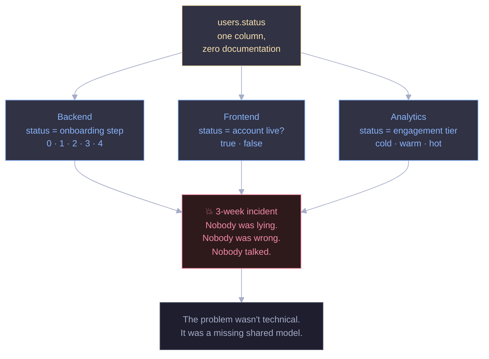
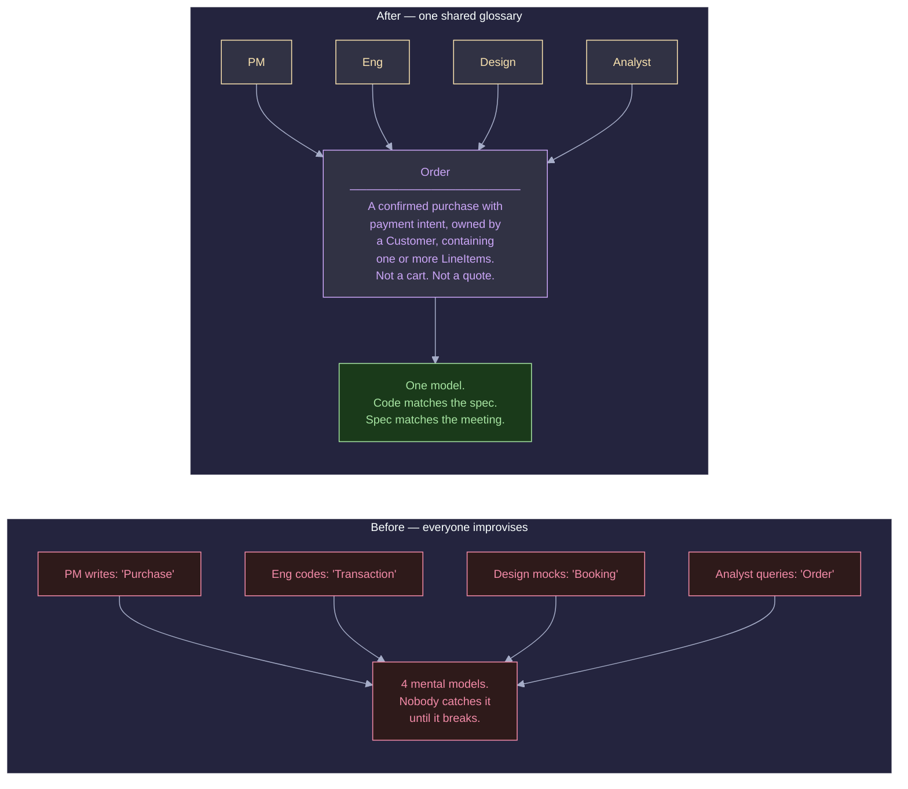
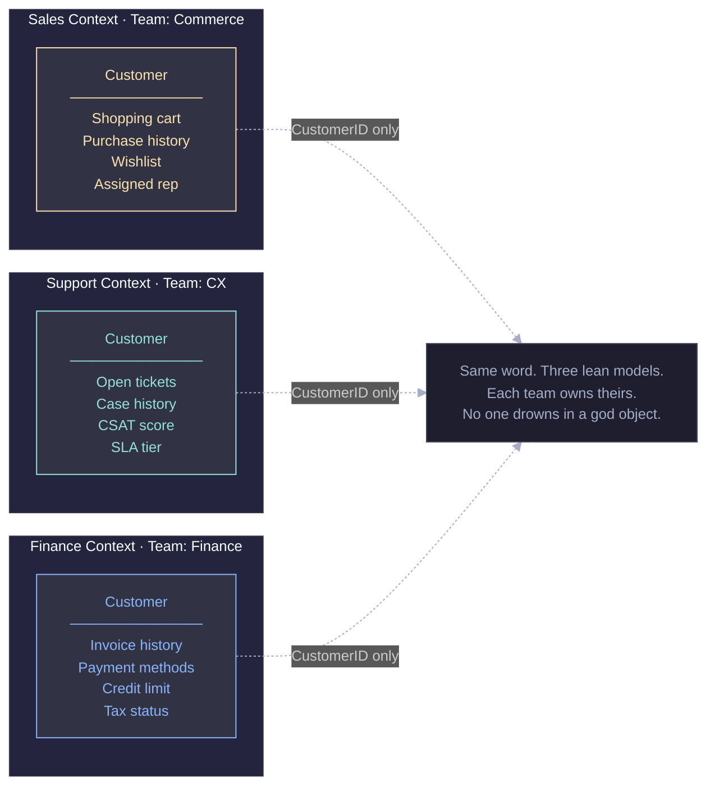
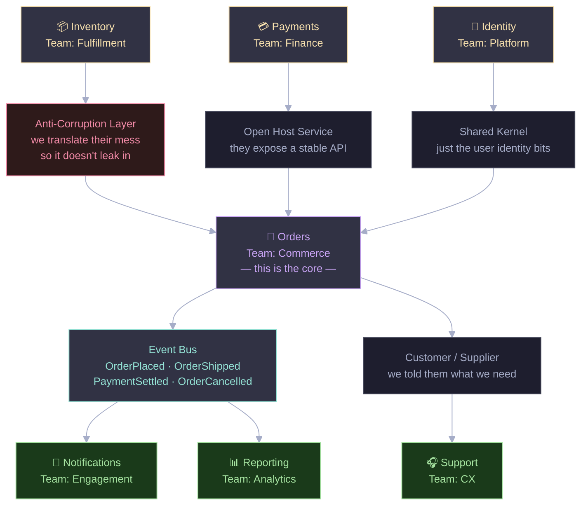
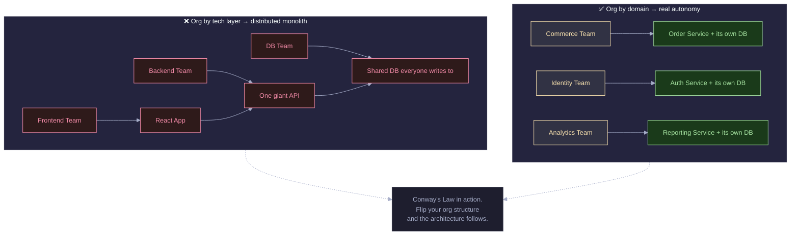
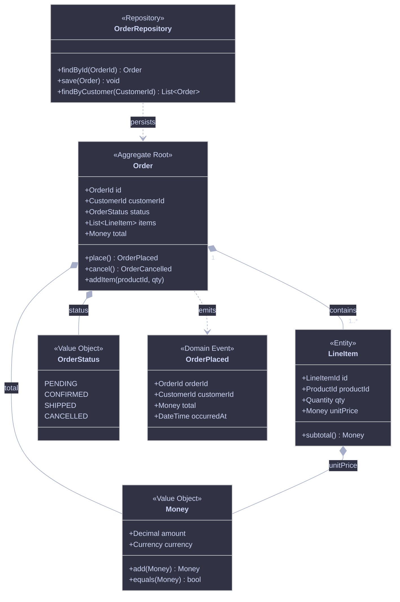
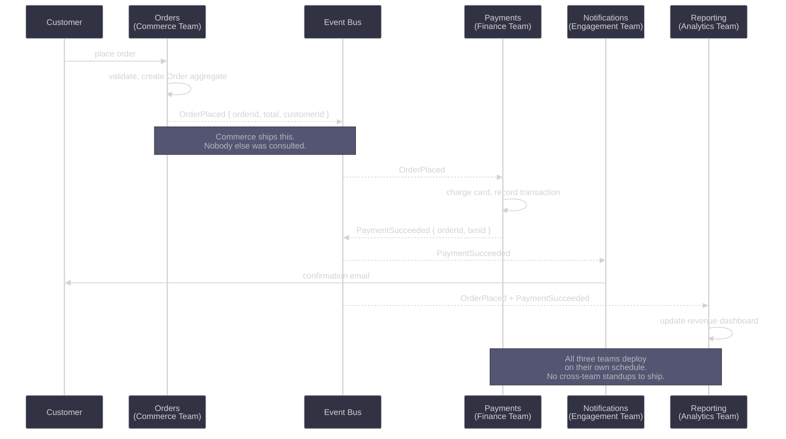
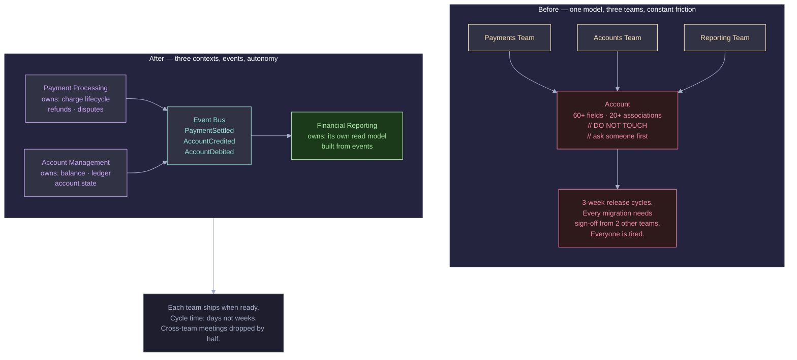

Let me tell you about a bug that took three weeks to track down.

The backend team had added a `status` column to the `users` table. They meant it to track onboarding progress — steps 0 through 4. The frontend team read the same field and treated it as a boolean: account active or not. The data team exported it weekly and bucketed users into cold, warm, and hot engagement tiers.

No one documented any of this. No one thought they needed to. The column was called `status`. What could be clearer?

Three teams. One column. Three completely different mental models quietly coexisting in production until the day they collided — a badly timed migration that broke the frontend, corrupted the analytics pipeline, and sent the on-call engineer on a three-week archaeological dig through git history.

That's the thing about collaboration failures. They don't announce themselves. They hide in the gap between what you think a word means and what your colleague thinks it means. And by the time you find them, you're usually staring at a production incident at 2am.

---

## It's not a people problem. It's a structure problem.

Most engineering managers diagnose this as a communication failure and reach for process. More standups. Mandatory documentation. A new confluence page that everyone writes to once and nobody ever reads again.

I've watched this play out at startups, at mid-sized companies, at enterprises. The Agile ceremonies don't fix it. The retrospectives surface it but don't solve it. The reason is that this isn't a people problem or a process problem. It's a **structural** problem.

When teams don't share a coherent model of the domain they're working in, every handoff becomes a translation exercise. And unlike foreign-language translation, nobody knows a translation is even happening. People assume they're speaking the same language because they're using the same words. They're not.

This is what Domain-Driven Design (DDD) addresses. Eric Evans introduced the term in 2003 and the core idea is deceptively simple: the structure of your software should reflect the structure of the business. Not the structure of your database. Not the structure of your org chart from three reorgs ago. The actual domain — the problem space your business exists to solve.

Where DDD gets interesting is in how deeply it treats language as a first-class design concern.

---

## Shared Language Isn't a Soft Skill — It's an Architecture Decision

DDD calls this *Ubiquitous Language*. The idea is that every team — engineers, product managers, designers, analysts — uses the exact same vocabulary to describe the domain. No synonyms. No "well, we call it an order but finance calls it a transaction." Just one term, one definition, used everywhere consistently.

That includes the code.

When engineers name their classes and methods using the same language the business uses, something subtle but powerful happens: a product manager can read the code and recognise the concepts. An engineer can read a product spec without mentally translating it. Bugs that come from misunderstanding requirements — a whole category of bugs — start to disappear.

The discipline this requires is harder than it sounds. You have to resist the urge to rename things to what *you* think is cleaner. You have to resist the abstraction instinct. If the business calls it an "Order", the class is `Order`. Not `PurchaseRecord`, not `TxnEntity`, not `SaleModel`.

The payoff is enormous. Teams that build on a shared language move noticeably faster because the gap between "what we decided" and "what we built" closes.

---

## Every Big Model Eventually Collapses Under Its Own Weight

Here's a trap almost every growing company falls into.

Things start simple. You have a `Customer` object. It has a name, an email, maybe a billing address. Everyone uses it. Fine.

Then Sales needs to add a preferred rep. Support needs to track open ticket counts. Finance needs invoice history and credit limits. Marketing wants engagement scores. Twelve months later, `Customer` has 60 fields, a confusing network of relationships, and a comment at the top of the file that says `// DO NOT TOUCH - ask @someone before changing anything`.

Nobody owns it, so everybody owns it. Which means nobody does.

DDD gives you the concept of a **Bounded Context** to deal with this. A Bounded Context is just a boundary — explicit, named, intentional — within which your model applies. Inside Sales, `Customer` means one thing. Inside Finance, `Customer` means something else. Both are valid. Neither one bleeds into the other.

The only thing they share is a stable identifier (a `CustomerID`) that lets them talk about the same real-world entity without needing to agree on every attribute.

This isn't just a modelling technique. It's a team ownership technique. Bounded Contexts map directly to team responsibilities. The Sales context is the Commerce team's problem. The Finance context is the Finance team's problem. When something breaks in Finance's `Customer` model, you know exactly whose phone to call. And crucially, the Commerce team doesn't need to be in that conversation at all.

---

## Drawing the Map Nobody Draws

Most teams have multiple contexts whether they know it or not. The problem is they're invisible. Dependencies between teams exist but nobody's written them down. You discover them when something changes upstream and breaks three things downstream that nobody knew were connected.

A **Context Map** makes the invisible visible. It's a diagram — doesn't have to be fancy, hand-drawn is fine — showing all your contexts and how they relate to each other.

What makes this useful isn't just the picture — it's the relationship labels. DDD has names for the different ways contexts can relate, and those names carry a lot of weight:

An **Anti-Corruption Layer** is what you build when you have to integrate with a system that has a messy model you don't control. You write a translation layer that converts their concepts into yours, so their chaos doesn't leak into your clean domain. If you've ever written an adapter for a third-party API with bizarre field names and six levels of nesting, you've built an ACL without knowing what to call it.

A **Shared Kernel** means two teams own a small, explicitly agreed piece of the model together. Changes require coordination. Use this sparingly — shared ownership is shared risk.

A **Customer/Supplier** relationship is refreshingly honest. The downstream team (customer) tells the upstream team (supplier) what they need, and the upstream team tries to deliver it. Not always with perfect success, but at least it's named.

Having names for these things matters because it lets you have more precise conversations. Instead of "we have a dependency," you can say "we're downstream from Payments in a Customer/Supplier relationship, and they keep breaking our integration." That's a different conversation.

---

## Your Architecture Is Just Your Team Structure, Reflected Back at You

Conway's Law is one of those observations that sounds cynical but is actually just true: any organisation that designs a system will produce a design whose structure mirrors the organisation's communication structure.

Teams that don't talk produce systems with unclear interfaces between them. Teams organised by technology layer — a frontend team, a backend team, a database team — produce a layered monolith. Not because anyone planned it that way, but because that's how the Conway attractor works.

The insight DDD gives you here is to use Conway's Law deliberately. If you want an architecture that's organised by business domain, organise your teams by business domain first. The architecture will naturally follow. This is sometimes called the "Inverse Conway Maneuver" and it's more effective than any amount of architectural governance.

---

## A Vocabulary for the Code Itself

The strategic stuff — contexts, maps, language — gets the most attention, but DDD also has a set of tactical patterns that give engineers a shared vocabulary for implementation. These are the building blocks you use once you've drawn your boundaries.

An **Aggregate** is a cluster of objects that change together, with a single root that controls access. In the diagram above, `Order` is the root. You never reach into a `LineItem` directly from outside — you always go through `Order`. This enforces consistency boundaries in a way that's explicit and understandable.

**Value Objects** are immutable. `Money` has no identity — a $10 value object is interchangeable with any other $10 value object of the same currency. This is a meaningful design decision that prevents a whole class of bugs (mutating a price on one object and accidentally affecting another).

**Domain Events** record facts. `OrderPlaced` means something happened — past tense, immutable, true. It's not a command. It's not a request. Something happened and we're recording it. This distinction matters for how teams interact with each other.

---

## Domain Events Are How Teams Stop Stepping on Each Other

The thing that changed how I think about team autonomy was understanding Domain Events properly. When a context publishes an event, it's announcing a fact to the rest of the world without knowing or caring who's listening. Other contexts react. No direct coupling. No "we need to call the Notifications team's endpoint before we can ship."

Notice what's missing: the Commerce team never calls the Notifications team directly. Engagement never has to wait on Finance to expose an API. Analytics doesn't need to ask Commerce for access to order data. Everyone reacts to shared facts. Everyone can ship without scheduling around everyone else.

This is the real payoff of Domain Events for collaboration. It's not a technical trick — it's a social contract encoded in architecture. "We commit to publishing accurate events. Do what you want with them."

---

## What This Actually Looked Like at a Real Company

A fintech startup I know had three teams sharing a Rails monolith. Payments, Accounts, and Reporting all worked in the same codebase, all writing to the same `Account` model. It had accumulated 60-something fields over 18 months. Nobody wanted to touch it.

Releasing anything required all three teams to coordinate. A Reporting query that nobody noticed would fail silently when Payments changed an account state transition. The Accounts team had a standing rule that any migration needed sign-off from two other teams before it went out. Releases happened every three weeks. Everyone was exhausted.

They ran an Event Storming workshop — three hours, lots of sticky notes, some heated arguments about what "account" actually meant. They came out with three clearly named contexts, a rough event schema, and the realisation that Reporting didn't actually need access to the `Account` model at all. It just needed events.

Six months later they were shipping daily. The `Account` model still existed in its original bloated form in Accounts context, but it was that team's problem to clean up on their own timeline. Finance had a lean model. Reporting had a read model built from events. Everyone owned their own thing.

---

## You Don't Have to Do All of This at Once

The reason DDD gets a reputation for being heavyweight is that people treat it as an all-or-nothing proposition. They read Evans' book, see 560 pages, and either implement everything or none of it. Neither is the right call.

```mermaid
%%{init: {'theme': 'dark', 'themeVariables': {'primaryColor': '#313244', 'primaryTextColor': '#CDD6F4', 'primaryBorderColor': '#45475A', 'lineColor': '#A6ADC8', 'background': '#1E1E2E', 'mainBkg': '#313244', 'clusterBkg': '#24243E', 'fontFamily': 'JetBrains Mono, monospace', 'fontSize': '13px'}}}%%
flowchart LR
    classDef yellow fill:#313244,stroke:#F9E2AF,color:#F9E2AF
    classDef blue   fill:#313244,stroke:#89B4FA,color:#89B4FA
    classDef green  fill:#1A3A1A,stroke:#A6E3A1,color:#A6E3A1
    classDef red    fill:#2E1A1A,stroke:#F38BA8,color:#F38BA8
    classDef mauve  fill:#313244,stroke:#CBA6F7,color:#CBA6F7
    classDef teal   fill:#313244,stroke:#94E2D5,color:#94E2D5
    classDef dim    fill:#1E1E2E,stroke:#45475A,color:#A6ADC8

    S1["1. Event Storming<br/>──────────<br/>3 hours, sticky notes,<br/>domain experts in the room.<br/>Surfaces what you don't know."]:::yellow

    S2["2. Shared Glossary<br/>──────────<br/>Pick your 5 most<br/>misused terms.<br/>Write definitions. Get sign-off."]:::blue

    S3["3. Context Map<br/>──────────<br/>Draw the boundaries<br/>that already exist<br/>but aren't documented."]:::mauve

    S4["4. Tactical Patterns<br/>──────────<br/>Value Objects for money.<br/>Domain Events for<br/>cross-team handoffs."]:::teal

    S5["5. Protect Boundaries<br/>──────────<br/>Anti-Corruption Layers<br/>for legacy systems and<br/>third-party APIs."]:::green

    S1 --> S2 --> S3 --> S4 --> S5
```

Start with the thing that gives you the most value with the least disruption. For most teams that's a combination of steps 1 and 2. Run an Event Storming session — just a few hours, domain experts and engineers in the same room, mapping out what actually happens in the business. Then build a glossary for the five terms that cause the most confusion in your standups.

You can do both of those things without touching your architecture. You'll still get an immediate improvement in how clearly your team communicates. The rest — the context boundaries, the tactical patterns, the event-driven integration — you layer in when it makes sense.

The trap to avoid is introducing DDD vocabulary without the discipline. If half the team calls it an Order and the other half still says Transaction, you haven't adopted Ubiquitous Language — you've just added jargon. Full commitment to the shared vocabulary is the one thing that shouldn't be done halfway.

---

## The Real Unlock

Here's the thing that doesn't get said enough about DDD: the primary benefit isn't better architecture. It's **faster trust**.

When teams have explicit boundaries, they can trust each other to stay inside them. When events are the handoff mechanism, no team can break another team's internals. When the language is shared, you stop wasting half a meeting realising you've been talking past each other.

That's what makes collaboration actually work at scale. Not more process. Not more documentation. Structures that make the right thing easy and the wrong thing obvious — so teams can move fast without constantly stepping on each other.

DDD gives you those structures. It took the software world a while to really absorb what Evans was getting at, but the core insight holds up: the way you model your domain determines how well your teams can work together. Get the model right, and a lot of the collaboration friction disappears.

Get it wrong, and no amount of Agile ceremony will save you.

---

*If you made it this far, your next move is simple: schedule a two-hour Event Storming session with your team. Bring in someone from product, someone from the business side, and your senior engineers. You'll be surprised how quickly the domain's real shape reveals itself — and how much everyone disagrees on terms you all thought you shared.*

---

**Tags:** Domain-Driven Design · Software Architecture · Team Collaboration · Engineering Culture · Microservices
