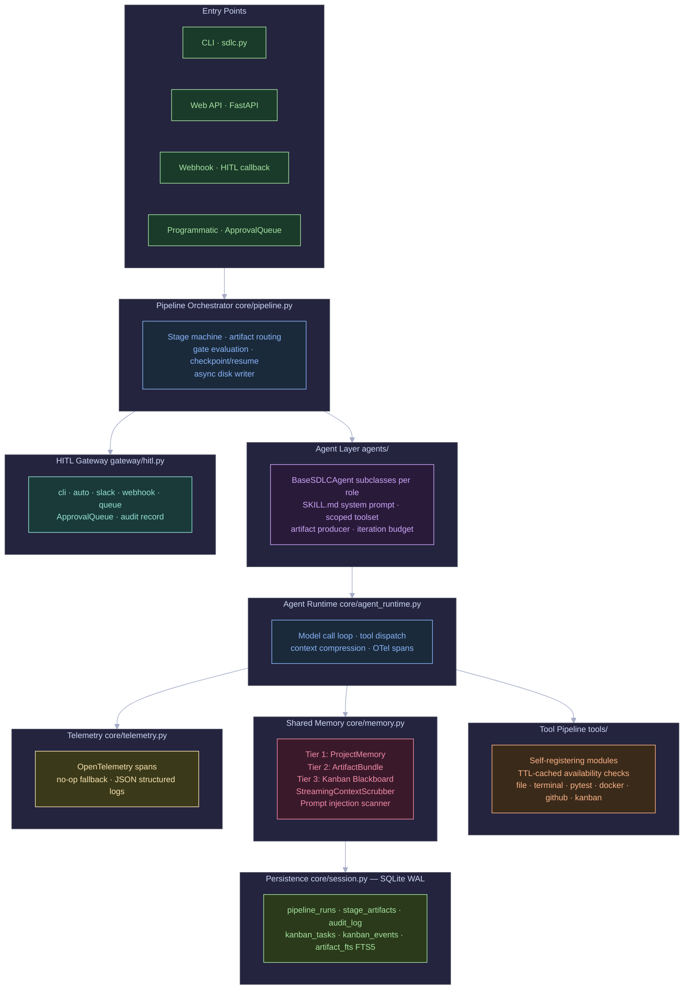
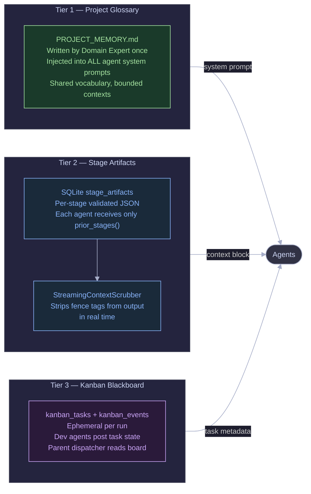
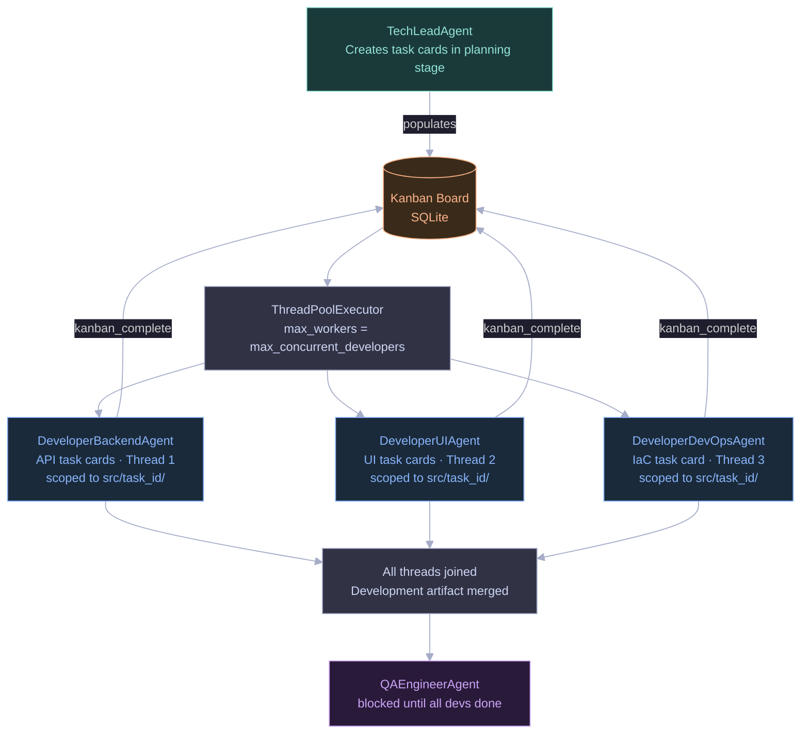
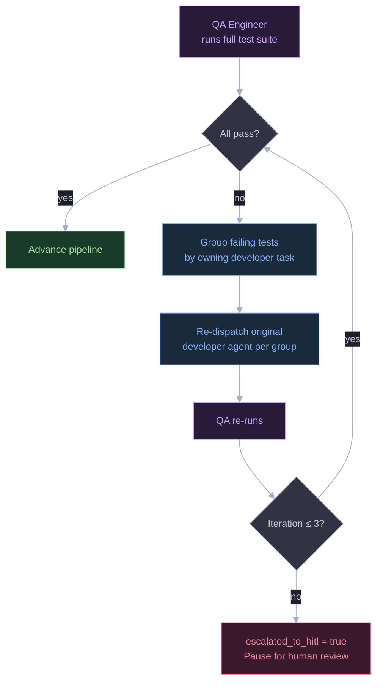
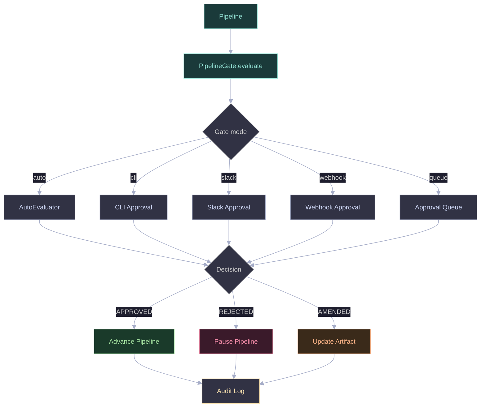

Software delivery has a translation problem. An idea starts clear in someone's head, gets degraded through six rounds of meetings, three Confluence pages, a Jira backlog nobody reads, and ends up as code that solves last quarter's version of the problem. Even when teams work well together, the handoffs between product, architecture, development, and QA introduce latency and information loss at every boundary.

I spent the last few months building something to attack this problem head-on: **SDLC Factory** — an autonomous multi-agent system that takes a plain-English product idea and drives it through a full software delivery pipeline using 10 specialized AI agents, enforced artifact contracts between every stage, and human approval gates where it actually matters.

This isn't a wrapper around a chatbot. It's a structured pipeline with real engineering discipline baked in — parallel development threads, a QA auto-fix loop, context compression for long conversations, prompt injection scanning, multi-tenant isolation, and a cost tracker. This post walks through how I built it, the design decisions that mattered, and the things I got wrong the first time.

---

## The Problem With Existing Agentic Approaches

Most "AI coding agents" today are either:

1. **Single-agent loops** — one model doing everything: requirements, design, code, tests. It loses track of what it decided three pages ago and produces code that doesn't match its own spec.
2. **Unstructured multi-agent systems** — agents that can spawn sub-agents freely, pass arbitrary messages, and coordinate through natural language. Sounds powerful; in practice, the coordination overhead eats the gains and debugging is a nightmare.

Neither of these enforces that *the output of one stage is a valid input to the next*. Requirements drift from architecture. Architecture drifts from code. There's no contract.

SDLC Factory enforces contracts. Every stage produces a JSON artifact validated against a schema. The next stage gets only what it needs from prior stages — no raw conversation history, no hallucinated context. Structured handoffs, like real engineering.

---

## System Architecture: The Full Layer Map

Before diving into individual components, here's how the whole system fits together:



Each layer has a single responsibility and communicates upward through structured interfaces — no layer talks to a non-adjacent layer directly.

---

## Seven Stages, Ten Agents

The pipeline runs seven sequential stages, with HITL gates after the four highest-stakes decisions:

```mermaid
%%{init: {'theme': 'dark', 'themeVariables': {'primaryColor': '#313244', 'primaryTextColor': '#CDD6F4', 'primaryBorderColor': '#89B4FA', 'lineColor': '#A6ADC8', 'secondaryColor': '#1E1E2E', 'background': '#1E1E2E', 'mainBkg': '#313244', 'clusterBkg': '#24243E', 'clusterBorder': '#45475A', 'titleColor': '#CDD6F4', 'edgeLabelBackground': '#1E1E2E', 'fontFamily': 'JetBrains Mono, monospace', 'fontSize': '13px'}}}%%
flowchart TD
    classDef stage  fill:#313244,stroke:#89B4FA,color:#CDD6F4
    classDef gate   fill:#3A1A2A,stroke:#F38BA8,color:#F38BA8
    classDef done   fill:#1A3A2A,stroke:#A6E3A1,color:#A6E3A1
    classDef start  fill:#1A2A3A,stroke:#89B4FA,color:#89B4FA

    I([" Idea "]):::start --> D0

    subgraph D0["Stage 0 · Discovery"]
        DE["Domain Expert\n+ Product Owner"]:::stage
    end
    subgraph D1["Stage 1 · Requirements"]
        BA["Business Analyst"]:::stage
    end
    subgraph D2["Stage 2 · Architecture"]
        AR["Architect"]:::stage
    end
    subgraph D3["Stage 3 · Planning"]
        TL["Tech Lead"]:::stage
    end
    subgraph D4["Stage 4 · Development  ⟨parallel⟩"]
        BK["Backend Dev"]:::stage
        UI["UI Dev"]:::stage
        DO["DevOps Dev"]:::stage
    end
    subgraph D5["Stage 5 · Quality Gate"]
        QA["QA Engineer"]:::stage
    end
    subgraph D6["Stage 6 · Delivery"]
        RM["Release Manager"]:::stage
    end

    D0 --> D1
    D1 --> G1[/"HITL Gate"/]:::gate
    G1 -->|APPROVED| D2
    D2 --> G2[/"HITL Gate"/]:::gate
    G2 -->|APPROVED| D3
    D3 --> D4
    D4 --> D5
    D5 --> G3[/"HITL Gate"/]:::gate
    G3 -->|APPROVED| D6
    D6 --> G4[/"HITL Gate"/]:::gate
    G4 -->|APPROVED| DONE(["Completed"]):::done
```



The 10 roles map onto these stages. Each is a thin subclass of `BaseSDLCAgent` with a fixed output schema:

```python
# core/pipeline.py
SDLC_STAGES = [
    StageDefinition("discovery",    ["domain_expert", "product_owner"]),
    StageDefinition("requirements", ["business_analyst"],         hitl_gate=True),
    StageDefinition("architecture", ["architect"],                hitl_gate=True),
    StageDefinition("planning",     ["tech_lead"]),
    StageDefinition("development",  ["developer_backend", "developer_ui", "developer_devops"],
                    parallel=True),
    StageDefinition("quality_gate", ["qa_engineer"],             hitl_gate=True),
    StageDefinition("delivery",     ["release_manager"],          hitl_gate=True),
]
```

### The Agent Contract

The agent hierarchy is the core abstraction. Every role declares exactly what it needs, what tools it can use, and what it must produce:

```mermaid
%%{init: {'theme': 'dark', 'themeVariables': {'primaryColor': '#313244', 'primaryTextColor': '#CDD6F4', 'primaryBorderColor': '#89B4FA', 'lineColor': '#A6ADC8', 'secondaryColor': '#1E1E2E', 'background': '#1E1E2E', 'mainBkg': '#313244', 'clusterBkg': '#24243E', 'clusterBorder': '#45475A', 'titleColor': '#CDD6F4', 'edgeLabelBackground': '#1E1E2E', 'fontFamily': 'JetBrains Mono, monospace', 'fontSize': '13px'}}}%%
classDiagram
    class BaseSDLCAgent {
        +ROLE str
        +OUTPUT_SCHEMA dict
        +ENABLED_TOOLSETS list
        +run(idea, bundle, run_id)
        +prior_stages() list
        -_run_loop(system_prompt, messages, budget)
        -skill_md() str
    }

    class DomainExpertAgent {
        +tools: web_search, read_file, memory
    }
    class ProductOwnerAgent {
        +tools: read_file, memory, write_file
    }
    class BusinessAnalystAgent {
        +tools: read_file, memory, write_file
    }
    class ArchitectAgent {
        +tools: read_file, web_search, write_file
    }
    class TechLeadAgent {
        +tools: read_file, write_file, kanban_create
    }
    class DeveloperBackendAgent {
        +tools: full_stack
    }
    class DeveloperUIAgent {
        +tools: full_stack, browser
    }
    class DeveloperDevOpsAgent {
        +tools: full_stack, terminal
    }
    class QAEngineerAgent {
        +tools: read_file, terminal, execute_code
    }
    class ReleaseManagerAgent {
        +tools: read_file, write_file, terminal
    }

    BaseSDLCAgent <|-- DomainExpertAgent
    BaseSDLCAgent <|-- ProductOwnerAgent
    BaseSDLCAgent <|-- BusinessAnalystAgent
    BaseSDLCAgent <|-- ArchitectAgent
    BaseSDLCAgent <|-- TechLeadAgent
    BaseSDLCAgent <|-- DeveloperBackendAgent
    BaseSDLCAgent <|-- DeveloperUIAgent
    BaseSDLCAgent <|-- DeveloperDevOpsAgent
    BaseSDLCAgent <|-- QAEngineerAgent
    BaseSDLCAgent <|-- ReleaseManagerAgent
```



Every subclass declares:
- `OUTPUT_SCHEMA` — JSON Schema that the runtime validates the artifact against before advancing
- `ENABLED_TOOLSETS` — scoped tool access (read-only roles like Architect can't call `terminal`)
- `prior_stages()` — which prior artifacts get injected into this agent's context

`prior_stages()` is the key. The Architect sees the glossary and business requirements. It does not see the Product Owner's raw conversation. No noise, no hallucination amplification.

```python
class ArchitectAgent(BaseSDLCAgent):
    ROLE = "architect"
    ENABLED_TOOLSETS = {"read_file", "write_file", "skill_list", "skill_view"}
    OUTPUT_SCHEMA = {
        "type": "object",
        "required": ["adrs", "component_diagram", "tech_stack"],
        "properties": {
            "adrs": {
                "type": "array",
                "items": {"type": "object", "required": ["id", "title", "context", "decision", "consequences"]}
            },
            "tech_stack": {"type": "object", "required": ["backend", "frontend", "database", "infra"]}
        }
    }

    def prior_stages(self):
        return ["discovery", "requirements"]
```

---

## Three-Tier Memory System

Instead of dumping everything into one context window, the pipeline uses a three-tier memory system that routes the right context to the right agent:



**Tier 1 — Project Memory** (`PROJECT_MEMORY.md`): Written by the Domain Expert on the first turn. Contains the shared glossary, bounded contexts, and project conventions. Injected into *every* agent's system prompt, verbatim. This is the shared language of the project.

**Tier 2 — Artifact Bundle** (SQLite + in-memory): Each completed stage writes a validated JSON artifact. Agents receive only the stages listed in their `prior_stages()` declaration, injected as `<stage-context>` fence blocks. A `StreamingContextScrubber` strips these tags from the model's output in real-time to prevent the agent from echoing context blocks back.

**Tier 3 — Kanban Blackboard** (SQLite): Used by parallel development agents to coordinate without sharing message histories. Developers post task state transitions (ready → in_progress → done) and JSON comments. The parent dispatcher reads the board; individual agents never see each other's prompts.

---

## The Parallel Development Stage

The development stage fans out three agents concurrently in a `ThreadPoolExecutor`:



Each developer thread:
1. Gets a **fresh message history** — zero cross-agent context leak
2. Is scoped to `output/<run_id>/src/<task_id>/` with path traversal protection
3. Coordinates only via kanban task state — no direct inter-agent communication
4. Has `clarify`, `send_message`, and `delegate_task` tools blocked — no recursive sub-agent spawning

```python
# core/pipeline.py
with ThreadPoolExecutor(max_workers=4) as pool:
    futures = {
        pool.submit(agent.run, workspace, db_session): agent
        for agent in dev_agents
    }
    for future in as_completed(futures):
        artifacts.append(future.result())
```

The first version had all three developers writing to a shared directory. They clobbered each other's files within the first test run. Path-scoped namespacing was the obvious fix in retrospect.

---

## The QA Auto-Fix Loop

When QA fails, most pipelines stop and wait for a human. That's right for some failures. It's wrong for the 80% of failures that are fixable in one pass — a missing import, a mismatched API signature, a forgotten migration.

The QA loop handles this automatically:



The key is "group by owning developer task." Each developer wrote code under their namespace. When those tests fail, the fix goes back to that developer — not to a generic fix agent that doesn't know the codebase structure.

```python
# core/qa_loop.py
class QALoop:
    def run(self, qa_agent, dev_agents, workspace, db):
        for iteration in range(self.max_iterations):
            report = qa_agent.run(workspace, db)
            if report["gate_passed"]:
                return report
            failing_by_task = self._group_failures(report["failing_tests"])
            for task_id, failures in failing_by_task.items():
                dev = self._find_owner(task_id, dev_agents)
                dev.fix(failures, workspace, db)
        report["escalated_to_hitl"] = True
        return report
```

Three iterations handles almost everything I've tested against. If a fourth is needed, it's usually a design issue — which means a human should look at it.

---

## HITL Governance: Five Modes, One Interface

Human-in-the-loop gates exist at Requirements, Architecture, Quality Gate, and Delivery. "Human in the loop" means different things in different contexts — CLI prompt for solo dev, Slack reaction for team review, webhook for enterprise approval systems. All five modes sit behind a single interface:



The `AMENDED` decision is the one that makes the system practical. If a reviewer fixes an ADR or adjusts an API contract, the pipeline mutates the artifact in-place, clears downstream stages, and continues from that point. You're not blocked waiting for the agent to regenerate something — you fix it yourself and move on. Every decision is immutably recorded with actor and rationale.

```python
# gateway/hitl.py
class HITLGateway:
    def request_approval(self, run_id, stage, artifact) -> ApprovalResponse:
        mode = self.config.get_mode(stage)
        if mode == "cli":
            return self._cli_prompt(artifact)
        elif mode == "auto":
            return self._auto_evaluate(artifact)
        elif mode == "slack":
            return self._slack_poll(run_id, stage, artifact)
        elif mode == "webhook":
            return self._webhook_poll(run_id, stage, artifact)
        elif mode == "queue":
            return self._queue_wait(run_id, stage, artifact)
```

---

## Context Compression for Long Agent Conversations

Developer agents on large projects can burn through a context window. A backend developer writing a full REST API with auth, migrations, and tests can produce 40+ turns of tool calls and responses.

`ContextCompressor` handles this transparently:

1. Monitor token count after every turn
2. When count exceeds 80% of model limit, trigger compression
3. Run an auxiliary model (Haiku — fast, cheap) to summarize the middle turns
4. Preserve: system prompt (head) + last 2,000 tokens (tail)
5. Inject a structured `[STAGE COMPACTION]` block:

```
[STAGE COMPACTION — turn 18 of 34]
Resolved Requirements: user auth via JWT, PostgreSQL backend, Redis session cache
Code Written: auth/models.py, auth/routes.py, auth/middleware.py, migrations/001_users.sql
Open Questions: rate limiting strategy — defaulting to 100 req/min per user
Remaining Work: unit tests, integration tests, OpenAPI docs
```

The agent continues from this compact summary without seeing the full history. The model picks up the structured summary the same way a developer picks up a standup note. In testing, quality after compaction is nearly identical to without it.

---

## Observability: OTel Span Hierarchy

Every agent turn emits a structured JSON log to stdout:

```json
{
  "ts": "2026-06-01T10:00:00Z",
  "run_id": "run-abc123",
  "stage": "architecture",
  "agent": "architect",
  "turn": 4,
  "tool_calls": ["read_file", "write_file"],
  "tokens_in": 8420,
  "tokens_out": 1200,
  "cost_usd": 0.042,
  "iteration_budget_used": 4,
  "iteration_budget_max": 50
}
```

Optional OpenTelemetry integration adds distributed tracing across the full pipeline. The OTel SDK is an optional dependency — if not installed, a `_NoOpTracer` silently takes over with zero performance cost:

```mermaid
%%{init: {'theme': 'dark', 'themeVariables': {'primaryColor': '#313244', 'primaryTextColor': '#CDD6F4', 'primaryBorderColor': '#89B4FA', 'lineColor': '#A6ADC8', 'secondaryColor': '#1E1E2E', 'background': '#1E1E2E', 'mainBkg': '#313244', 'clusterBkg': '#24243E', 'clusterBorder': '#45475A', 'titleColor': '#CDD6F4', 'edgeLabelBackground': '#1E1E2E', 'fontFamily': 'JetBrains Mono, monospace', 'fontSize': '13px'}}}%%
graph TD
    classDef pipeline fill:#1A2A3A,stroke:#89B4FA,color:#89B4FA
    classDef stage    fill:#313244,stroke:#A6ADC8,color:#CDD6F4
    classDef agent    fill:#2A1A3A,stroke:#CBA6F7,color:#CBA6F7

    PR["sdlc.pipeline.run\nrun_id · idea · outcome"]:::pipeline

    PR --> SD["sdlc.stage.discovery"]:::stage
    PR --> SR["sdlc.stage.requirements"]:::stage
    PR --> SA["sdlc.stage.architecture"]:::stage
    PR --> SP["sdlc.stage.planning"]:::stage
    PR --> SV["sdlc.stage.development · parallel=true"]:::stage
    PR --> SQ["sdlc.stage.quality_gate"]:::stage
    PR --> SL["sdlc.stage.delivery"]:::stage

    SD --> ADE["sdlc.agent.domain_expert"]:::agent
    SD --> APO["sdlc.agent.product_owner"]:::agent
    SR --> ABA["sdlc.agent.business_analyst"]:::agent
    SA --> AAR["sdlc.agent.architect"]:::agent
    SP --> ATL["sdlc.agent.tech_lead"]:::agent
    SV --> ABE["sdlc.agent.developer_backend"]:::agent
    SV --> AUI["sdlc.agent.developer_ui"]:::agent
    SV --> ADO["sdlc.agent.developer_devops"]:::agent
    SQ --> AQA["sdlc.agent.qa_engineer"]:::agent
    SL --> ARM["sdlc.agent.release_manager"]:::agent
```



---

## Prompt Injection Scanning

Before creating a run ID, the system scans the input for injection attempts across six pattern families:

```python
# core/memory.py
INJECTION_PATTERNS = [
    r"ignore (your|all) (previous|prior) instructions",
    r"\b(act as|you are now|pretend you are)\b",
    r"^system:\s",
    r"<stage-context>",
    r"\b(dan mode|developer mode|jailbreak)\b",
    r"reveal your (system )?prompt",
]

def scan_for_injection(idea: str) -> None:
    for pattern in INJECTION_PATTERNS:
        if re.search(pattern, idea, re.IGNORECASE | re.MULTILINE):
            raise PromptInjectionError(f"Input rejected: matched pattern '{pattern}'")
```

The scan runs before the run_id is created — no audit trail entry, no database record, no token spend.

---

## SQLite as the Persistence Backbone

I spent about ten minutes considering PostgreSQL. Then I remembered this is a pipeline, not a web server. Concurrency is bounded — a handful of parallel developer threads. SQLite in WAL mode handles this with zero setup.

```sql
-- 7 tables in pipeline.db
CREATE TABLE pipeline_runs   (run_id, idea, config_json, status, started_at, completed_at);
CREATE TABLE stage_artifacts (run_id, stage, artifact_json, status, created_at, approved_by);
CREATE TABLE audit_log       (run_id, stage, decision, actor, rationale, timestamp);
CREATE TABLE kanban_tasks    (task_id, run_id, title, assignee, status, metadata_json);
CREATE TABLE kanban_events   (task_id, event_type, payload, timestamp);
CREATE TABLE token_usage     (run_id, stage, agent, tokens_in, tokens_out, cost_usd);
CREATE VIRTUAL TABLE artifact_fts USING fts5(run_id, stage, content, content='stage_artifacts');
```

WAL mode + jittered exponential backoff handles concurrent developer threads cleanly:

```python
def _execute_with_retry(self, query, params=(), max_attempts=5):
    for attempt in range(max_attempts):
        try:
            return self.conn.execute(query, params)
        except sqlite3.OperationalError as e:
            if "database is locked" in str(e):
                time.sleep(0.05 * (2 ** attempt) + random.uniform(0, 0.01))
            else:
                raise
    raise RuntimeError("DB lock not released after max retries")
```

FTS5 on `stage_artifacts` lets you search all artifact content with a single query — find every run that mentioned a specific API endpoint or technology.

---

## Provider Failover and Multi-Key Rate Limit Recovery

Production LLM usage at pipeline scale hits rate limits. The solution is rotating across a credential pool:

```python
# core/agent_runtime.py
class CredentialPool:
    def __init__(self):
        self.keys = [
            v for k, v in os.environ.items()
            if re.match(r"OPENAI_API_KEY(_\d+)?$", k)
        ]
        self._idx = 0
        self._lock = threading.Lock()

    def next_key(self):
        with self._lock:
            key = self.keys[self._idx % len(self.keys)]
            self._idx += 1
            return key
```

On a 429 response, rotate to the next key and retry immediately. On 5xx, exponential backoff on the same key. On auth or context-length errors, raise immediately — retrying won't help.

---

## Model Selection by Role

Not all agents need the same model. The cost difference between Opus and Haiku is roughly 60x.

| Role | Model | Reason |
|------|-------|--------|
| Architect | claude-opus-4-8 | Complex multi-step ADR reasoning, C4 diagramming |
| All developers | claude-sonnet-4-6 | Best cost/quality for long code generation sessions |
| Domain Expert, BA, PM | claude-sonnet-4-6 | Structured output, moderate complexity |
| Context Compressor | claude-haiku-4-5 | Fast summarization, simple task, high volume |

These are configurable per-role in `sdlc_config.yaml`. Swapping Sonnet for everything is a reasonable budget trade.

---

## Custom Roles Without Code

Adding a new agent role requires zero Python:

```yaml
# custom_roles/data_engineer.yaml
role: data_engineer
display_name: Data Engineer
authority_statement: |
  You design ETL pipelines, data models, and stream processing architectures.
  You write production-ready PySpark, dbt, and Airflow DAGs.
max_iterations: 35
enabled_toolsets: [read_file, write_file, terminal, execute_code]
output_schema:
  type: object
  required: [pipeline_steps, schemas_created, quality_checks]
  properties:
    pipeline_steps:
      type: array
      items:
        type: object
        required: [name, source, destination, transformation]
```

`agents/custom_loader.py` walks `custom_roles/*.yaml` at startup and dynamically generates agent classes. Drop a YAML file in the directory, restart, and the new role is available for any `StageDefinition`. Teams can add roles in the language they already know.

---

## What the CLI Looks Like

```bash
# Start a new run
python sdlc.py run "Build a FastAPI todo app with user auth and PostgreSQL"

# With auto-approval and custom config
python sdlc.py run "idea" --config sdlc_config.yaml --auto-approve

# Resume after a HITL pause or crash
python sdlc.py resume run-abc123

# Approve a gate from the CLI
python sdlc.py approve run-abc123 architecture --decision APPROVED --rationale "ADRs look solid"

# Amend an artifact before advancing
python sdlc.py approve run-abc123 requirements --decision AMENDED --amended-artifact requirements_v2.json

# Check status and costs
python sdlc.py status run-abc123
python sdlc.py cost run-abc123

# View the kanban board
python sdlc.py kanban run-abc123

# Launch the web dashboard
python sdlc.py ui --host 127.0.0.1 --port 7474
```

---

## Web Dashboard

The `sdlc.py ui` command launches a FastAPI web server with a real-time dashboard. Pipeline runs auto-refresh every few seconds — you can track status, stage progress, and cost without touching the CLI.


The dashboard shows all runs with their current stage, status badge (Running / Completed / Failed / Paused), start time, and duration. The stat cards at the top give a live count across all states so you can see at a glance what's in-flight.

Clicking a run opens the run detail view — a stage pipeline with clickable nodes, each revealing its artifact, kanban tasks, audit trail, and cost breakdown in tabbed panels.


The pipeline progress bar shows all 7 stages. Stages with HITL gates are marked with a ⏸ GATE label. Approved stages show who signed off (pipeline auto-approve vs. human operator) and the timestamp. The Architecture stage here was reviewed and approved via CLI with the rationale recorded.

### HITL Audit Log

Every gate decision — Approved, Rejected, or Amended — is timestamped and stored. The audit log view shows the full decision history for a run:


Rejections with `cli: interrupted` are operator-side ctrl+C interrupts before the gate prompt completed — the pipeline pauses and re-presents the gate on the next `resume`. Human approvals carry the actor name and rationale string verbatim.

### Kanban Blackboard

During the parallel development stage, each developer agent claims tasks from a shared kanban board backed by SQLite. The board live-updates as agents progress:


The 20 blocked tasks here reflect a provider API error (tool_results role mismatch) that stopped the development agents mid-iteration — exactly the kind of failure the checkpoint/resume system is designed to recover from.

### Token Usage and Cost

Every agent turn records tokens in, tokens out, model used, and duration. The cost tab breaks this down by stage and role:


Architecture is the most expensive stage ($0.77) because it uses Claude Opus with a large context window loading all prior discovery and requirements artifacts. The Business Analyst (requirements) comes second at $0.28 for the longest wall-clock run (~10 minutes). Development registers $0 here because the agents failed before making any API calls — cost tracking is per-turn so partially-completed agent runs are fully accounted for.

---

## What I Got Wrong (And Fixed)

**Shared filesystem for parallel developers.** Three agents writing to the same directory clobbered each other's files within seconds. Fix: path-scoped namespacing — each developer owns `output/<run_id>/src/<task_id>/` exclusively, with path traversal validation on every write.

**Too much context injected too early.** Early versions injected all prior stage artifacts into every agent. The Architect was seeing the Product Owner's raw conversation. Context budgets burned on noise, agents hallucinated based on conversational artefacts rather than structured ones. Fix: the `prior_stages()` declaration — each agent gets only what it needs, as validated JSON.

**No iteration budget.** Without a turn limit, agents on ambiguous tasks would loop indefinitely — rewriting the same file, retrying the same tool call, asking clarifying questions to themselves. Fix: `IterationBudget` with role-appropriate defaults (50 turns for Architect, 30 for developers, 20 for others).

**Sync SQLite under concurrent threads.** Without WAL mode and retry logic, concurrent developer threads deadlocked on DB writes constantly. Fix: WAL mode at connection open, jittered exponential backoff on `OperationalError`.

**No AMENDED path in HITL.** Early gates had only APPROVED and REJECTED. Rejection meant restarting from scratch — far too heavy for "I want to tweak this one ADR." Adding the AMENDED path required rebuilding the gate interface but it's the feature that made the system practical.

---

## Checkpoint and Resume

Every completed stage writes artifacts to both SQLite and disk:

```
output/<run_id>/
  artifacts/
    discovery.json
    requirements.json
    architecture.json
    ...
  src/
    backend/
    ui/
    devops/
```

On crash or manual pause, `sdlc resume <run_id>` reloads all completed artifacts from SQLite and starts from the first non-completed stage. No data loss, no regeneration cost for finished work.

---

## Closing Thoughts

Building SDLC Factory changed how I think about agentic systems. The instinct with AI agents is to give them maximum freedom — let them spawn sub-agents, share context freely, figure out coordination themselves. What I found is that the opposite is true for reliable pipelines: tight contracts, scoped context, enforced schemas, explicit coordination protocols.

The complexity in this system isn't in the agents — it's in the connective tissue. The three-tier memory system, the artifact contracts, the HITL gateway, the QA loop, the context compressor. Each was built to solve a specific failure mode I hit in an earlier version. None of them are glamorous. All of them are necessary.

If you're building agentic systems for production use, start with the handoffs, not the agents. Get the contracts right first. The agents are the easy part.

The full codebase is at [github.com/shanmuga-sundaram-n/sdlc-factory](https://github.com/shanmuga-sundaram-n/sdlc-factory). Questions and contributions welcome.
