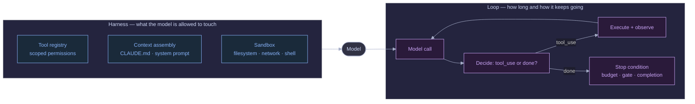
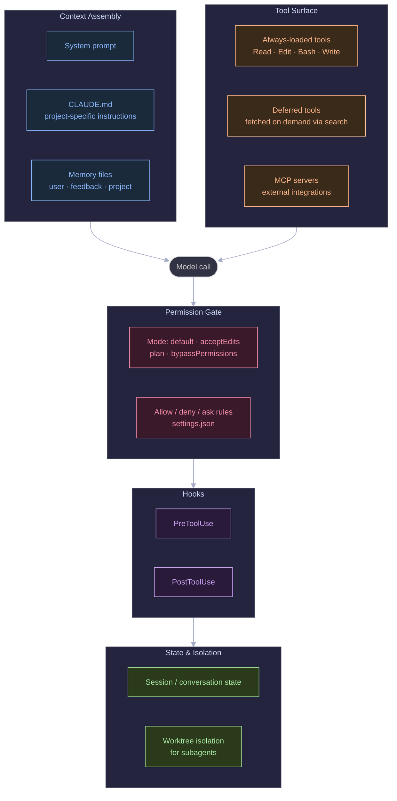
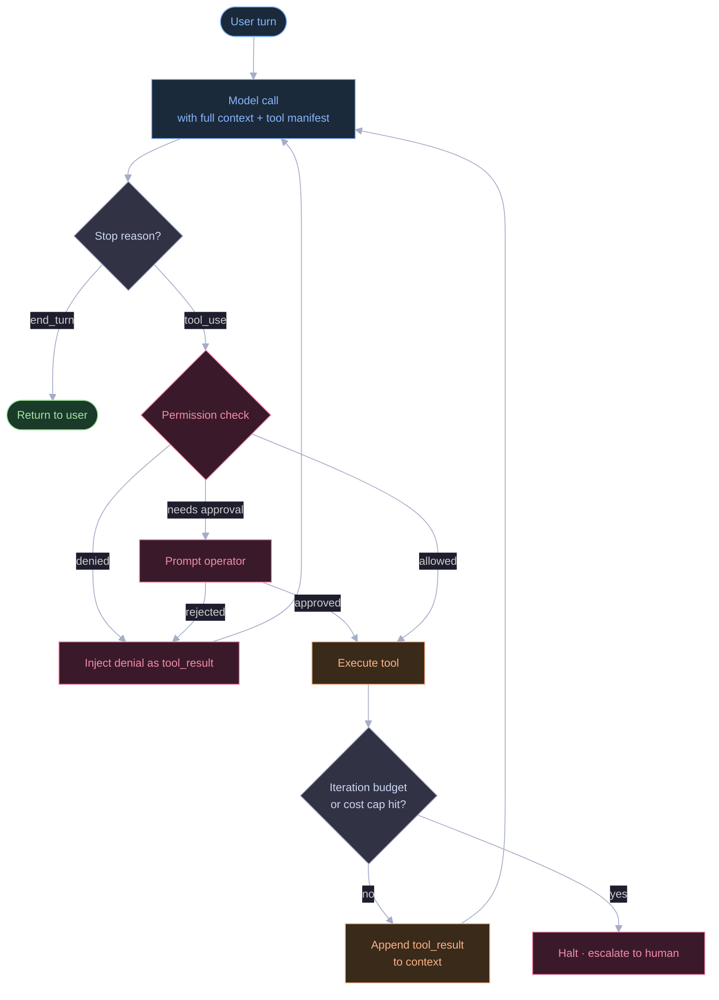
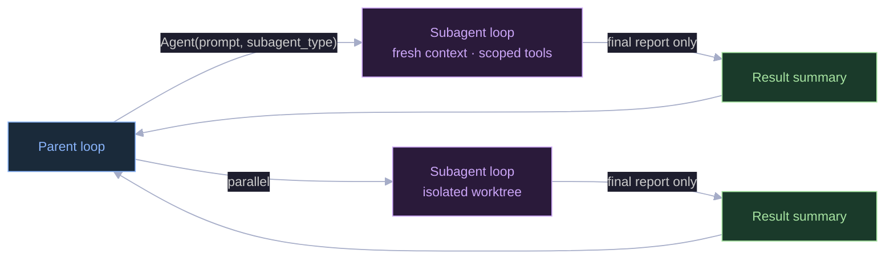

Start with what an **AI agent** actually is, because the term gets thrown around loosely. An agent is a language model (an LLM — the kind of AI behind ChatGPT or Claude) that isn't just answering a question once. It's allowed to take actions — read a file, run a command, search the web — look at what happened, and decide what to do next, on its own, in a loop, until the task is done. A plain chatbot takes one input and gives one output. An agent takes an input and can act repeatedly, unsupervised, for as long as it takes.

That extra power is where things get interesting — and risky. **Prompt engineering** is the well-known discipline of wording your instructions well so a model gives a good answer in a single response. It's necessary, but it's not enough once a model is allowed to act repeatedly on its own. Once it's running in a loop — reading its own results, deciding what to do next, deciding when to stop — a second, less-talked-about discipline shows up underneath it. Not "what do I say to the model," but "what do I build *around* it."

I've been calling these two halves **harness engineering** and **loop engineering**. They're not the same thing, even though people casually call both of them "the agent."

- The **harness** is everything the model is *allowed to do* — which tools it can call, what files it can touch, what commands are off-limits, how much context it sees before it even starts.
- The **loop** is the *control flow* that keeps calling the model, checking what it wants to do, letting it (or not), feeding the result back, and deciding when to stop.

Get the harness wrong and a capable model does dangerous or useless things — it wasn't told not to. Get the loop wrong and a well-scoped, well-behaved model still runs forever, burns your budget, or quietly drifts off the original task because nothing was watching for that.

This post explains both from the ground up, then walks through one realistic example — an agent that auto-fixes failing tests in a pull request — end to end: why you need these controls, what to build, and how to build it. I'll use Claude Code's own observable behavior (permission modes, hooks, subagents, on-demand tool loading, `CLAUDE.md` project instructions) as the running example throughout, because it's a harness I use every day and can describe from direct experience.

---

## A Few Terms, Defined Up Front

If you've built with LLM APIs before, skim this. If you haven't, these five terms show up constantly below and are worth pinning down first:

- **Context window** — the total amount of text (measured in *tokens*, roughly word-fragments) a model can "see" at once, including its instructions, the conversation so far, and anything it just read. It's finite — usually a few hundred thousand tokens — and everything you put in it costs money and pushes out room for something else.
- **System prompt** — a block of instructions given to the model before the conversation starts, setting its role, rules, and boundaries. The user never sees it directly; it shapes how the model behaves throughout.
- **Tool call / tool use** — when a model, instead of just replying with text, asks to run a specific action — "call the `Bash` tool with this command" — and waits for the result before continuing. This is the mechanism that turns a chatbot into an agent.
- **MCP (Model Context Protocol)** — a standard way to plug external systems (Slack, a database, Google Drive) into an agent as tools, without writing custom integration code for each one.
- **Sandbox** — a restricted environment (limited filesystem access, no network, a disposable container) that limits what a tool call can actually affect, even if the model asks for something dangerous.

Everything else gets defined the first time it comes up.

---

## Two Different Failure Modes, Two Different Disciplines

The clearest way to see why harness and loop are separate concerns is to look at what breaks when you skip each one.

**Skip harness engineering** and the model has no boundaries. It can call any tool with any argument, read files outside the project, run destructive shell commands, or leak sensitive output — not out of malice, but because *nothing told it not to*. This is a **scope failure**: the model did something it should never have been allowed to attempt in the first place.

**Skip loop engineering** and the model has boundaries but no brakes. It re-reads the same file five times, retries a failing action in an endless cycle, or keeps going "one more turn" until the conversation is so long it has to be summarized repeatedly and it forgets what it was originally asked to do. This is a **termination failure**: everything the model did was individually allowed, but nothing ever told it — or forced it — to stop.



Reading this diagram left to right: the **harness** (left box) is set up once, before anything runs — it defines the walls. The **loop** (right box) is what happens turn after turn once the model is running: call it, see if it wants to use a tool, act on that if it's allowed, and go around again until something says stop. Most public "prompt engineering" advice only ever talks about the small "Model" circle in the middle. Harness and loop engineering is everything else in this picture — and that's where almost all the reliability problems in real agentic systems actually live.

---

## Anatomy of a Harness

A harness is the set of things that are true about the model's environment *before it ever generates a single word*. Think of it like onboarding a new contractor: before they touch anything, you've already decided what systems they can log into, what files they can edit, and who has to approve what. The harness is that setup, made explicit and enforced in code. For a coding agent like Claude Code, it looks roughly like this:



Five boxes, five jobs. Before going deeper, here's what each one means in plain terms:

- **Context Assembly** — what information the model gets to see before it starts working: its instructions, any project-specific rules, anything remembered from before.
- **Tool Surface** — the full list of actions the model is even capable of requesting. If a tool isn't in this list, the model can't call it, period — this is the first and strongest form of control.
- **Permission Gate** — for tools that *are* available, whether a specific call is allowed to actually run, or needs a human to approve it first.
- **Hooks** — small pieces of code that run automatically before or after a tool call, regardless of what the model "intended."
- **State & Isolation** — what gets remembered between turns, and what stays walled off between separate agents working at the same time.

Four of these deserve a closer look, because they're the parts people skip when building their own agent harness from scratch.

### Deferred tool loading — why you don't hand over every tool at once

Every tool a model can call comes with a technical description (its "schema") — what it's called, what arguments it takes, what it does. That description has to sit somewhere the model can read it, and the model can only read what's in its context window. If your harness has forty tools fully described in context, you're paying that token cost on *every single turn*, whether or not any of those forty tools get used that turn. It's like handing a new employee the entire 500-page employee handbook to re-read before every single task, instead of pointing them to the one relevant page when they need it.

The fix — and it's the pattern I work inside of daily, since it's literally how this environment I'm writing in behaves — is to show the model a short list of tool *names* by default, and only load the full technical description for a tool once something in the conversation suggests it's actually needed:

```
# What the model sees by default — just names, cheap to include:
CronCreate, CronDelete, WebFetch, SendMessage, ... (names only)

# Only after the model asks for one specifically:
ToolSearch("select:WebFetch") → full parameter schema, now callable
```

This matters more as the tool list grows. MCP (defined above — the plug-in standard for external tools) makes it trivial to add a dozen integrations. Without deferred loading, every one of those tool descriptions sits in every prompt permanently, whether the current task touches Slack, a database, or neither.

### Permission modes — a dial, not an on/off switch

The simplest possible harness is binary: the model can do anything, or it has to ask permission for everything. Neither extreme is good — the first is reckless, the second is so annoying that people just disable it. Claude Code's actual modes point at something better: `default` (ask before risky actions), `acceptEdits` (auto-approve file edits but still ask about other things), `plan` (research and read only, no changes allowed at all), `bypassPermissions` (fully trusted, no asking). Permission posture is a dial the person running the agent sets based on how much they trust it and how bad it would be if something went wrong — not a single fixed setting. A file edit and a `git push --force` are not the same risk level and shouldn't require the same approval step.

### Hooks — policy enforced in code, not requested in English

You can *ask* a model in its instructions not to run destructive commands, and it will usually listen — "usually" is the key word. Or you can write a **hook**: a small script that runs automatically before a tool executes (a `PreToolUse` hook) and can block the call outright, regardless of what the model decided to do. The difference matters the moment "usually" isn't good enough — anywhere there's a compliance requirement, a security-sensitive repository, or an audit trail that has to be airtight. Put plainly: instructions in a prompt are a request. A hook is a rule the code enforces whether the model agrees or not. Don't mix the two up when the stakes are real.

---

## Anatomy of a Loop

If the harness is the set of walls, the loop is what actually happens inside them, turn after turn: call the model, see what it wants to do, act on it if it's allowed, feed the result back, and repeat — until there's nothing left to do, or a limit gets hit.



Walking through this in words: the model gets called. It replies with a `stop_reason` — a label the API attaches to every response telling you *why* it stopped generating. If that reason is `end_turn`, the model has a final answer and you hand it back to the user — done. If the reason is `tool_use`, the model is asking to run something, and *that's* the moment the permission check from the harness section actually gets consulted. If it's denied, the model is told so (as a `tool_result` — the standard way of feeding an action's outcome back into the conversation) and gets to try something else. If it's allowed, the tool runs, the result gets appended to the conversation, and the whole thing loops back to another model call — unless a budget or cost limit has been hit, in which case it stops and escalates to a human instead of continuing silently.

The two decision diamonds — the permission check and the budget check — are the entire discipline. Everything else in that diagram is plumbing.

### A minimal loop, in actual code

Every production agent framework wraps this in more ceremony, but the core of it is small enough to read start to finish, and doing that once makes the diagram click:

```python
def run_loop(client, system_prompt, tools, user_message, max_iterations=25):
    # messages is the running conversation — every model reply and every
    # tool result gets appended here, and the whole thing is sent back
    # to the model on the *next* call so it has full context of what happened.
    messages = [{"role": "user", "content": user_message}]

    for iteration in range(max_iterations):
        # One call to the model. It sees the system prompt (its instructions),
        # the tools it's allowed to request, and the conversation so far.
        response = client.messages.create(
            model="claude-sonnet-5",
            system=system_prompt,
            tools=tools,
            messages=messages,
        )
        messages.append({"role": "assistant", "content": response.content})

        if response.stop_reason != "tool_use":
            return response  # model gave a final answer — end_turn — we're done

        # The model wants to run one or more tools. Each one shows up as a
        # separate "tool_use" block inside response.content.
        tool_results = []
        for block in response.content:
            if block.type != "tool_use":
                continue

            decision = check_permission(block.name, block.input)  # harness boundary
            if decision == "denied":
                result = f"Denied: {block.name} is not permitted in this context"
            else:
                result = execute_tool(block.name, block.input)    # harness boundary

            # tool_result tells the model what happened — success, failure,
            # or a denial reason — so it can decide what to do on the next turn.
            tool_results.append({
                "type": "tool_result",
                "tool_use_id": block.id,
                "content": result,
            })

        messages.append({"role": "user", "content": tool_results})

    # We reached the iteration cap without the model ever giving a final
    # answer — that's the loop's safety valve, not an edge case to ignore.
    raise IterationBudgetExceeded(f"No terminal response after {max_iterations} turns")
```

Notice what's deliberately *not* in this function: retry logic, summarizing old messages to save space, cost tracking, spawning other agents. Those are all real requirements for a production harness, but each one hooks into this same loop at one specific, narrow point — the `check_permission` call, the `execute_tool` call, or the iteration limit at the top. Resist the urge to build all of that before the basic loop is solid. A loop with a simple hardcoded iteration cap and a basic permission check that actually terminates correctly beats an elaborate one that doesn't terminate at all.

---

## Subagents: Loops Spawning Loops

Once the base loop above works, a natural next question comes up: what happens when one task is too big for one context window, or needs to be kept separate from the main conversation — a code reviewer that shouldn't see the same back-and-forth as the person who wrote the code, or a research task that would otherwise clutter the main thread with dozens of search results?

The answer, in Claude Code's model and in most serious multi-agent systems, is: do the same thing again, at a smaller scale. A **subagent** is a second, independent instance of the harness-plus-loop described above — its own tools, its own permission checks, its own iteration budget, its own conversation history — invoked by the main ("parent") agent as if it were just another tool call.



Two details in that diagram matter more than the shape itself. First, **"fresh context"** — the subagent starts with no memory of the parent's conversation, only what's explicitly handed to it. Second, and more important: the parent only ever gets back the subagent's **final report**, never its turn-by-turn transcript. It never sees every file the subagent read or every command it tried — just the summary at the end.

That single design choice is doing real work. **Worktree isolation** — giving each subagent its own copy of the project files to edit, instead of sharing one — prevents two agents from overwriting each other's changes if they're working in parallel. And hiding the intermediate steps keeps the parent's own context window from filling up with a subagent's internal back-and-forth, which is exactly the kind of context-window scarcity described earlier. This is the same idea I used in a multi-agent pipeline I described in an [earlier post](/blog/2026/06/06/sdlc-factory-autonomous-multi-agent-pipeline/): each stage only received the *finished output* of the stage before it, never that stage's raw internal conversation. Harness and loop engineering aren't really separable in practice — they're the same design decision, looked at from two different angles.

---

## Where This Breaks in Practice

**Unbounded loops disguised as thoroughness.** A model given a broad task and no iteration cap will happily read every file in a large project "to be thorough." Wanting more context isn't the bug — the bug is that nothing stopped it. An iteration cap isn't a hack bolted on as an afterthought, it's the loop's only real safety valve, and it should scale with how risky the task is: a subagent that only reads files can reasonably be given more turns than one that's allowed to delete or overwrite things.

**Tool schema bloat.** Every MCP integration you add puts more tool descriptions into the model's context. Past a certain point, each additional tool costs more in context space than it adds in capability — and worse, it raises the odds the model picks the *wrong* tool for the job because there are too many similar-looking options. The fix is on-demand loading (described above), not simply "add fewer tools" — you often genuinely need the capability, just not paid for on every single turn whether it's used or not.

**Permission checks that only look at the tool name.** `Bash` (a tool that runs a shell command) isn't one risk level — `ls` (list files, harmless) and `rm -rf` (delete everything, recursively, no confirmation) are both "the Bash tool." A harness that only checks *which tool* is being called, not *what it's being asked to do*, ends up either too permissive (allow all `Bash` calls) or too annoying (ask about every single one, even harmless ones). The permission layer has to look at the actual arguments, not just which door the request came through.

**Losing the "why" during context compaction.** When a long-running loop's conversation gets too big for the context window, older parts get summarized to make room — this is called **compaction**. It's easy for that summary to keep *what* happened (which files were touched, which commands ran) while losing *why* (the reasoning that ruled out a different approach three steps earlier). A compaction summary that's just a list of actions will cause the loop to re-try things it already decided against. Good compaction preserves the reasoning, not just the action log.

**Confusing "the model refused" with "the harness blocked it."** These can look identical in a transcript but need opposite fixes. If the model itself is declining to do something reasonable, that's a system-prompt problem — adjust the instructions. If a hook or a permission rule is silently blocking something it shouldn't be, that's a harness bug — and it's easy to misdiagnose as "the model being difficult" when the real fix is in your `PreToolUse` hook, not in the wording of your prompt.

---

## A Worked Example: A CI Auto-Fix Agent, Why → What → How

Everything above is easier to hold onto against one concrete, start-to-finish scenario. This is the kind of agent teams reach for early: **watch a pull request's failing automated tests (CI, short for continuous integration) and have the agent push a fix.**

### Why you need this — what the naive version actually does

The naive build takes twenty minutes: give the model three tools — `Bash` (run shell commands), `Edit` (modify an existing file), `Write` (create a file). System prompt says *"Fix the failing tests in this PR. Don't touch unrelated code."* Wrap it in a loop that keeps calling the model until it says it's done. Ship it.

Here's what actually happens on the first real pull request, not a clean demo:

1. **It runs forever.** One of the failing tests is *flaky* — it fails intermittently for reasons unrelated to the code. The model "fixes" it, the flake reappears on the next run, the model reverts its own fix, the flake happens to pass by chance, the model declares victory, the tests rerun and the flake is back. Forty turns later it's still bouncing between two versions of the same function.
2. **It edits files outside the PR.** Nothing actually *enforced* "don't touch unrelated code" — that instruction only works if the model happens to follow it. Partway through, it notices an unrelated warning two files over and "cleans it up while it's in there." What should have been a two-line fix now touches eleven files.
3. **It runs a destructive command.** Trying to get to a clean starting state, it runs `git checkout .` — a command that discards *any* uncommitted changes in the project — to clear out what it assumes are stray edits. One of those "stray edits" was a colleague's unsaved work sitting in the same workspace.

None of these are the model "misbehaving" in some mysterious sense. Each one is a specific missing control, and each maps directly onto the ideas from earlier in this post:

| Failure | Missing control | Which side |
|---|---|---|
| Runs forever, oscillates | No stop condition beyond "the model says it's done" | Loop |
| Edits unrelated files | No check on what `Edit`/`Write` is actually touching | Harness |
| Destructive `git` command | No check on what the `Bash` command actually says | Harness |

### What to do about it

None of the fixes below require a new framework — they just require the permission check and the stop condition to actually *inspect what's happening*, instead of trusting the prompt to be enough on its own:

- **Restrict `Edit`/`Write` to the PR's own changed-file list.** Not "the whole repository," not "the whole codebase" — specifically the files this PR already touches, nothing more. Anything outside that list gets denied before it ever executes.
- **Check the actual `Bash` command text, not just the fact that `Bash` was called.** A deny-list of destructive patterns — `rm -rf`, `git push --force`, `git checkout .`, `git reset --hard` — checked against every command before it runs.
- **Replace "the model says it's done" with an actual progress signal.** Track how many tests are failing after each attempt. If that number hasn't gone down across the last few tries, that's not thoroughness — that's a stuck loop. Stop and hand it to a human instead of quietly burning through the rest of the budget.

### How to build it

Both pieces below are simple, deterministic checks — plain code, not another call to the model — which is exactly why they're cheap enough to run on every single tool call without slowing anything down or costing anything extra.

**First, the scope check.** This plugs into the exact same `check_permission` step from the minimal loop shown earlier — it runs *before* a tool executes, so a bad call never happens in the first place:

```python
import re

# Only files this specific PR already modifies — computed once, up front,
# from the PR's diff. Nothing outside this list is in scope.
ALLOWED_PATHS = get_changed_files(pr_diff)

# Regex patterns matched against the literal command string before it runs.
DANGEROUS_COMMANDS = [
    r"rm\s+-rf",              # recursive, forced delete
    r"git\s+push\s+.*--force", # overwrites remote history
    r"git\s+checkout\s+\.",    # discards all local uncommitted changes
    r"git\s+reset\s+--hard",   # discards all local changes and history
]

def check_permission(tool_name, tool_input):
    if tool_name in ("Edit", "Write"):
        path = tool_input["file_path"]
        if path not in ALLOWED_PATHS:
            return "denied", f"{path} is outside this PR's changed-file scope"

    if tool_name == "Bash":
        command = tool_input["command"]
        if any(re.search(pattern, command) for pattern in DANGEROUS_COMMANDS):
            return "denied", f"blocked destructive command: {command}"

    return "allowed", None
```

**Second, the progress check.** This plugs into the loop itself — it runs *after* each tool result comes back, watching for the "no improvement" pattern. The only new piece of state compared to the minimal loop earlier is `failure_counts`, a running list of how many tests failed after each attempt:

```python
def run_ci_fix_loop(client, system_prompt, tools, pr_context, max_iterations=15):
    messages = [{"role": "user", "content": pr_context}]
    failure_counts = []

    for iteration in range(max_iterations):
        response = client.messages.create(
            model="claude-sonnet-5", system=system_prompt, tools=tools, messages=messages
        )
        messages.append({"role": "assistant", "content": response.content})

        if response.stop_reason != "tool_use":
            return response

        tool_results = []
        for block in response.content:
            if block.type != "tool_use":
                continue

            decision, reason = check_permission(block.name, block.input)
            if decision == "denied":
                result = f"Denied: {reason}"
            else:
                result = execute_tool(block.name, block.input)
                # Every time the agent runs the test suite, record how many
                # tests are still failing — this is the progress signal.
                if block.name == "Bash" and "pytest" in block.input.get("command", ""):
                    failure_counts.append(count_failures(result))

            tool_results.append({"type": "tool_result", "tool_use_id": block.id, "content": result})

        messages.append({"role": "user", "content": tool_results})

        # If the last 3 test runs show the exact same failure count,
        # the agent isn't making progress — it's stuck, not being thorough.
        if len(failure_counts) >= 3 and len(set(failure_counts[-3:])) == 1:
            escalate_to_human(reason="no progress in last 3 test runs", transcript=messages)
            return None

    escalate_to_human(reason="iteration budget exceeded", transcript=messages)
```

**Third, a backup layer for the destructive-command case.** This one lives *outside* the Python code entirely, as a **hook** (defined earlier) — so even if there's a bug in `check_permission` someday, this second, independently-maintained check still catches it:

```json
// .claude/settings.json — enforced regardless of what the loop code does
{
  "hooks": {
    "PreToolUse": [
      {
        "matcher": "Bash",
        "hooks": [{ "type": "command", "command": "scripts/block-destructive-git.sh" }]
      }
    ]
  }
}
```

That's defense in depth, not needless duplication — `check_permission` and the hook are two separate pieces of code, maintained separately, and a mistake in one doesn't remove the protection from the other.

### What this actually buys you

Run this improved version against the same flaky-test PR: the progress check fires after three flat test runs instead of forty turns of silent back-and-forth. Run it against the "let me also clean up this unrelated file" case: the `Edit` call gets denied before it ever touches disk, and the model is told *why* — so it adjusts instead of blindly retrying. Run it against the `git checkout .` case: it's blocked twice — once by the argument check in Python, once by the hook — and either way, there's a clear record of what was attempted and why it was stopped.

Same task, same underlying model, same intent in the prompt. The only thing that changed is that the harness and the loop stopped assuming the prompt alone was enough to keep the model inside the lines.

---

## Closing Thoughts

Prompt engineering optimizes a single model response. Harness engineering and loop engineering optimize *a system that takes many actions on its own initiative* — which is what "agent" actually means once you get past the marketing, whether or not that word shows up anywhere in your architecture. The two are cleanly separable in theory: harness is what's allowed, loop is how long it runs and how it decides to keep going. In practice they're tightly coupled, because every property you actually care about in production — bounded cost, bounded blast radius, graceful failure instead of silent failure, the ability to recover from a mistake — gets enforced right at the seam between the two.

If you're building on top of an existing harness like Claude Code or the Claude Agent SDK rather than writing the loop yourself, this discipline doesn't disappear — it just moves. You're not writing `check_permission` by hand, but you *are* writing `settings.json` rules, hooks, and `CLAUDE.md` scope. You're not writing the iteration cap yourself, but you *are* deciding subagent boundaries and what information is allowed to cross them. The underlying decisions are the same ones described in this post; only who's responsible for making them changes.

If you're building your first agent, start with the seam, not the prompt. Get the permission boundary and the stop condition right before anything else — everything downstream is far easier to fix once those two hold.
